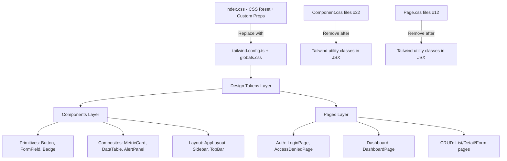

# Design Document — Dashboard UI Redesign

## Overview

This design covers the complete visual transformation of the SYK Dashboard from a light-themed vanilla CSS implementation to a modern, dark-themed SaaS-grade interface using TailwindCSS. The redesign preserves all existing component logic, React patterns, and application structure while replacing the styling layer entirely.

**Key decisions:**
- TailwindCSS v4 with custom theme tokens replaces all co-located `.css` files
- Dark palette (#0B2239 → #E7C7D2) applied consistently across all surfaces
- Component APIs remain unchanged — only internal JSX class attributes change
- Migration proceeds component-by-component to allow incremental verification
- Existing property tests (calculateTotals, clientValidation, dataReducer, etc.) remain untouched since logic doesn't change

**Inspiration:** Stripe, Linear, Vercel — glass + soft UI aesthetic with high information density.

---

## Architecture

### High-Level Migration Architecture



### Technology Stack

| Layer | Current | Target |
|-------|---------|--------|
| Styling engine | Vanilla CSS + Custom Properties | TailwindCSS v4 |
| Design tokens | CSS `:root` variables | `tailwind.config.ts` theme |
| Component styles | Co-located `.css` files | Utility classes in JSX |
| Fonts | Fira Code + Fira Sans (Google Fonts) | Inter (bundled via `@fontsource`) |
| Color scheme | Light (#F8FAFC background) | Dark (#0B2239 background) |

### Migration Strategy

The migration follows a bottom-up approach:

1. **Phase 1 — Foundation**: Install TailwindCSS, create `tailwind.config.ts`, replace `index.css` with Tailwind base + globals
2. **Phase 2 — Primitives**: Migrate Button, FormField, Badge, EmptyState, ConfirmDialog
3. **Phase 3 — Composites**: Migrate MetricCard, DataTable, AlertBell, AlertPanel, Loading Skeletons
4. **Phase 4 — Layout**: Migrate AppLayout, Sidebar, TopBar (these depend on primitives being complete)
5. **Phase 5 — Pages**: Migrate all 12 pages (these depend on all components being migrated)
6. **Phase 6 — Cleanup**: Remove all `.css` files, delete `index.css` legacy reset, verify build

Each component migration:
1. Add Tailwind classes to JSX
2. Verify visual output matches design spec
3. Delete co-located `.css` file
4. Run existing tests to confirm logic is unaffected

---

## Components and Interfaces

### Design Token Configuration (`tailwind.config.ts`)

```typescript
import type { Config } from 'tailwindcss';

const config: Config = {
  content: ['./index.html', './src/**/*.{ts,tsx}'],
  theme: {
    extend: {
      colors: {
        'bg-primary': '#0B2239',
        'bg-secondary': '#193A59',
        'surface': '#2A4058',
        'secondary': '#4D6A8A',
        'text-muted': '#8FA6BD',
        'accent-soft': '#D1AFC0',
        'highlight': '#E7C7D2',
        'accent': '#C084A0',
        // Semantic status colors
        'success': { DEFAULT: '#10B981', muted: 'rgba(16, 185, 129, 0.15)' },
        'warning': { DEFAULT: '#F59E0B', muted: 'rgba(245, 158, 11, 0.15)' },
        'destructive': { DEFAULT: '#EF4444', muted: 'rgba(239, 68, 68, 0.15)' },
      },
      fontFamily: {
        sans: ['Inter', 'system-ui', '-apple-system', 'sans-serif'],
        mono: ['Fira Code', 'monospace'],
      },
      borderRadius: {
        'xl': '12px',
        '2xl': '16px',
      },
      boxShadow: {
        'soft': '0 2px 8px rgba(0, 0, 0, 0.25)',
        'elevated': '0 8px 24px rgba(0, 0, 0, 0.4)',
        'glow': '0 0 12px rgba(192, 132, 160, 0.3)',
      },
      spacing: {
        '18': '4.5rem',
        '88': '22rem',
      },
      transitionDuration: {
        '150': '150ms',
        '200': '200ms',
      },
      maxWidth: {
        'content': '1280px',
      },
    },
  },
  plugins: [],
};

export default config;
```

### Global Styles (`src/globals.css`)

Replaces the current `index.css`. Minimal — only base resets and font imports that Tailwind doesn't handle:

```css
@tailwind base;
@tailwind components;
@tailwind utilities;

@layer base {
  html {
    -webkit-font-smoothing: antialiased;
    -moz-osx-font-smoothing: grayscale;
    text-rendering: optimizeLegibility;
  }

  body {
    @apply bg-bg-primary text-white font-sans min-h-dvh;
  }

  #root {
    @apply min-h-dvh flex flex-col;
  }

  /* Focus ring utility */
  :focus-visible {
    @apply outline-2 outline-offset-2 outline-accent rounded-sm;
  }
}

/* Tabular/monospace data */
[data-tabular] {
  @apply font-mono;
}

/* Screen-reader only */
.sr-only {
  @apply absolute w-px h-px p-0 -m-px overflow-hidden whitespace-nowrap border-0;
  clip: rect(0, 0, 0, 0);
}
```

### Layout Components

#### AppLayout

```
┌────────────────────────────────────────────────┐
│ Sidebar (w-64 │ w-16 collapsed)  │   TopBar    │
│               │                   │ (sticky h-16)│
│  ┌─────────┐  │  ┌────────────────────────────┐│
│  │  Logo   │  │  │   Content (max-w-content)  ││
│  │  Nav    │  │  │                            ││
│  │  Items  │  │  │                            ││
│  │         │  │  │                            ││
│  │  User   │  │  │                            ││
│  └─────────┘  │  └────────────────────────────┘│
└────────────────────────────────────────────────┘
```

**AppLayout** — CSS Grid layout: `grid-cols-[auto_1fr]`
- Sidebar: fixed-width column (`w-64` expanded, `w-16` collapsed)
- Main area: flex column containing TopBar + scrollable content
- On mobile (<768px): single column, sidebar as overlay

#### Sidebar Interface (unchanged API)

```typescript
interface SidebarProps {
  isOpen: boolean;
  onClose: () => void;
}
```

New visual features:
- Collapsed state with icon-only + tooltip
- Active item: left border accent (#C084A0) + subtle bg tint
- Smooth width transition (200ms ease-in-out)
- Brand logo at top
- User info at bottom

#### TopBar Interface (unchanged API)

```typescript
interface TopBarProps {
  onMenuToggle: () => void;
}
```

New visual features:
- Sticky positioning
- Search placeholder on desktop
- Background #0B2239 with #2A4058 bottom border

### Primitive Components

#### Button (unchanged API)

```typescript
interface ButtonProps {
  variant?: 'primary' | 'secondary' | 'destructive' | 'ghost';
  size?: 'sm' | 'md' | 'lg';
  disabled?: boolean;
  onClick?: () => void;
  children: React.ReactNode;
  type?: 'button' | 'submit' | 'reset';
  className?: string;
}
```

Tailwind class mapping:
| Variant | Classes |
|---------|---------|
| primary | `bg-accent text-white hover:bg-accent/90` |
| secondary | `bg-transparent border border-secondary text-text-muted hover:border-accent-soft` |
| destructive | `bg-red-900 text-red-100 hover:bg-red-800` |
| ghost | `bg-transparent text-text-muted hover:text-white` |

Sizes: `sm: px-3 py-1.5 text-sm`, `md: px-4 py-2 text-base`, `lg: px-6 py-3 text-lg`

Common: `rounded-xl transition-all duration-150 focus-visible:ring-2 focus-visible:ring-accent focus-visible:ring-offset-2 focus-visible:ring-offset-bg-primary disabled:opacity-50 disabled:pointer-events-none`

#### FormField (unchanged API)

```typescript
interface FormFieldProps {
  label: string;
  error?: string;
  children: ReactNode;
  htmlFor?: string;
}
```

Input styling: `bg-bg-secondary border border-secondary rounded-xl text-white placeholder:text-secondary focus:border-accent focus:shadow-glow transition-all duration-150`

#### StatusBadge (new component)

```typescript
interface StatusBadgeProps {
  status: 'active' | 'pending' | 'completed' | 'critical';
  children: React.ReactNode;
}
```

Pill shape: `inline-flex items-center rounded-full px-2.5 py-0.5 text-xs font-medium`

Status colors:
| Status | Classes |
|--------|---------|
| active | `bg-success-muted text-success` |
| pending | `bg-warning-muted text-warning` |
| completed | `bg-secondary/30 text-text-muted` |
| critical | `bg-destructive-muted text-destructive` |

### Composite Components

#### MetricCard (unchanged API)

```typescript
interface MetricCardProps {
  title: string;
  value: number;
  icon: ReactNode;
  variant?: 'default' | 'accent' | 'warning' | 'destructive';
}
```

Container: `bg-surface rounded-2xl shadow-soft p-5 hover:-translate-y-0.5 hover:shadow-elevated transition-all duration-200`

Icon container variant mapping:
| Variant | Icon bg |
|---------|---------|
| default | `bg-secondary/20` |
| accent | `bg-accent/20` |
| warning | `bg-warning/20` |
| destructive | `bg-destructive/20` |

Grid layout for cards: `grid grid-cols-1 sm:grid-cols-2 lg:grid-cols-3 xl:grid-cols-4 gap-4`

#### DataTable (unchanged API)

```typescript
interface DataTableProps<T> {
  columns: Column<T>[];
  data: T[];
  onRowClick?: (item: T) => void;
  rowClassName?: (item: T) => string;
  emptyMessage?: string;
}
```

Container: `bg-surface rounded-2xl shadow-soft overflow-hidden`
Header: `bg-bg-secondary text-text-muted uppercase text-xs tracking-wider`
Row hover: `hover:bg-bg-secondary transition-colors duration-150`
Row border: `border-b border-secondary/50`

#### LoadingSkeleton (new component)

```typescript
interface SkeletonProps {
  variant: 'card' | 'row' | 'text' | 'circle';
  count?: number;
  className?: string;
}
```

Animation: `animate-pulse bg-gradient-to-r from-surface to-bg-secondary rounded-xl`

#### AlertPanel (unchanged API)

Dropdown container: `bg-surface rounded-2xl shadow-elevated border border-secondary/30`
Severity indicators: colored left border (red for critical, amber for warning)

### Page Components

All pages maintain existing default exports for lazy loading. Only internal markup changes to use Tailwind classes.

#### LoginPage

Full-viewport centered layout:
```
bg-bg-primary min-h-dvh flex items-center justify-center
```

Card:
```
bg-bg-secondary rounded-2xl shadow-elevated border border-surface p-8 w-full max-w-md
```

---

## Data Models

No data model changes. The redesign is purely visual — all TypeScript interfaces in `src/types/` remain unchanged:

- `src/types/models.ts` — Product, Order, Quotation, Client, etc.
- `src/types/auth.ts` — User, AuthState, Role
- `src/types/actions.ts` — DataAction union types

The only new type addition is the `StatusBadge` component interface and the `LoadingSkeleton` component interface (defined above in Components section).

---

## Correctness Properties

*A property is a characteristic or behavior that should hold true across all valid executions of a system — essentially, a formal statement about what the system should do. Properties serve as the bridge between human-readable specifications and machine-verifiable correctness guarantees.*

This feature is primarily a UI rendering and styling redesign. Most acceptance criteria test visual presentation (colors applied, animations triggered, layout at breakpoints) which are best validated through visual regression tests and example-based unit tests rather than property-based testing.

However, one computable property exists: **WCAG contrast ratio compliance** across the new dark palette. The project already has a `getContrastRatio` utility (`src/lib/contrastCheck.ts`) that makes this programmatically verifiable.

### Property 1: Dark palette color pairs meet WCAG AA contrast thresholds

*For any* text/background color pair defined in the dark theme design system, the computed contrast ratio SHALL be ≥ 4.5:1 for normal-sized text and ≥ 3:1 for large text (≥18px or ≥14px bold).

**Validates: Requirements 2.2, 13.1**

**Defined color pairs to validate:**

| Text Color | Background | Usage | Min Ratio |
|-----------|-----------|-------|-----------|
| #FFFFFF | #0B2239 | Primary text on body | 4.5:1 |
| #FFFFFF | #193A59 | Primary text on sidebar/cards | 4.5:1 |
| #FFFFFF | #2A4058 | Primary text on surface | 4.5:1 |
| #8FA6BD | #0B2239 | Muted text on body | 4.5:1 |
| #8FA6BD | #193A59 | Muted text on sidebar | 4.5:1 |
| #8FA6BD | #2A4058 | Muted text on surface | 3:1 (large) |
| #C084A0 | #0B2239 | Accent on body | 3:1 (large) |
| #C084A0 | #193A59 | Accent on sidebar | 3:1 (large) |
| #E7C7D2 | #0B2239 | Highlight text on body | 4.5:1 |
| #E7C7D2 | #2A4058 | Highlight text on surface | 4.5:1 |

**Test approach:** Update existing `src/lib/contrastCheck.property.test.ts` to validate the new dark palette pairs. The existing property test infrastructure (symmetry, identity) remains valid. The app-specific color pair tests get replaced with dark palette pairs.

---

## Error Handling

No changes to error handling logic. The redesign only affects visual presentation of errors:

| Error Type | Current Handling | Visual Change |
|-----------|------------------|---------------|
| Form validation | Red border + error text below input | Same behavior, new colors: `border-destructive text-destructive text-sm` |
| Login error | Alert message display | Styled with `bg-destructive-muted border-l-4 border-destructive text-red-200 p-3 rounded-xl` |
| Empty states | Centered message | Enhanced with illustration placeholder + accent CTA button |
| Network errors | Existing error boundaries | No change to logic; visual styling updated |
| 404 / Access Denied | Dedicated pages | Dark-themed centered cards with appropriate messaging |

All existing error boundaries, try/catch patterns, and validation logic in `src/lib/` remain unchanged.

---

## Testing Strategy

### Approach

This is a **UI rendering redesign** — the primary testing concern is visual correctness, not logic correctness. The existing property tests for business logic (`calculateTotals`, `clientValidation`, `dataReducer`, `formValidation`, etc.) serve as regression guards confirming that logic remains intact after visual changes.

### Test Categories

#### 1. Existing Property Tests (regression — no changes needed)

All existing `.property.test.ts` files continue to pass since component logic is unchanged:
- `calculateTotals.property.test.ts`
- `clientValidation.property.test.ts`
- `computeAlerts.property.test.ts`
- `dataReducer.property.test.ts`
- `depositValidation.property.test.ts`
- `filterByStatus.property.test.ts`
- `formValidation.property.test.ts`
- `searchFilter.property.test.ts`
- `stockValidation.property.test.ts`
- `DueDateIndicator.property.test.ts`
- `LowStockIndicator.property.test.ts`
- `useDataScope.property.test.ts`

#### 2. Updated Property Test: Contrast Compliance

Update `src/lib/contrastCheck.property.test.ts` to validate new dark palette pairs against WCAG AA thresholds. Uses the existing `getContrastRatio` utility.

**Library:** fast-check (already installed)
**Iterations:** 100 minimum per property
**Tag:** `Feature: dashboard-ui-redesign, Property 1: Dark palette color pairs meet WCAG AA contrast thresholds`

#### 3. Example-Based Unit Tests (new)

For each migrated component, add or update render tests verifying:
- Correct Tailwind classes are applied based on props (variant, size, state)
- ARIA attributes remain intact after migration
- Keyboard interaction behavior is preserved
- Conditional rendering logic unchanged

Key components to test:
- `Button` — all 4 variants × 3 sizes, disabled state, focus ring
- `StatusBadge` — all 4 status states
- `MetricCard` — all variants, hover classes present
- `DataTable` — header styling, row hover, empty state, clickable rows
- `Sidebar` — expanded/collapsed state, active item highlight, mobile overlay
- `LoadingSkeleton` — all variants render correct shape

#### 4. Visual Regression (recommended, not automated in this spec)

For full visual validation, the team should consider:
- Storybook with Chromatic or Percy for screenshot comparison
- Manual review at each breakpoint (375px, 768px, 1024px, 1440px)
- Dark theme consistency check across all pages

#### 5. Accessibility Audit

- Automated: axe-core integration in component tests
- Manual: keyboard navigation flow through Sidebar, DataTable, forms
- Contrast: validated programmatically via Property 1

### Test Commands

```bash
pnpm test              # Run all tests (vitest --run)
pnpm test -- --grep "contrast"  # Run contrast property tests only
```

### Migration Verification Checklist

For each component migration:
1. ✅ `pnpm test` passes (logic unchanged)
2. ✅ `pnpm build` succeeds (no type errors)
3. ✅ Visual inspection at mobile, tablet, desktop breakpoints
4. ✅ Keyboard navigation works (Tab, Enter, Escape)
5. ✅ Co-located `.css` file deleted
