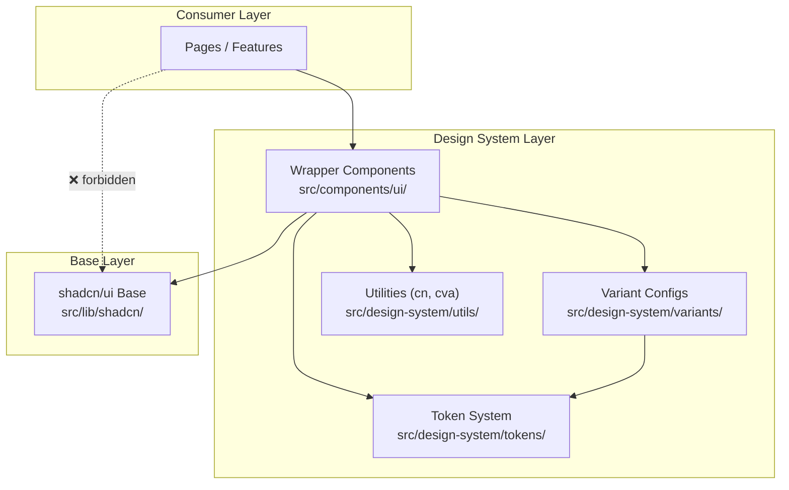
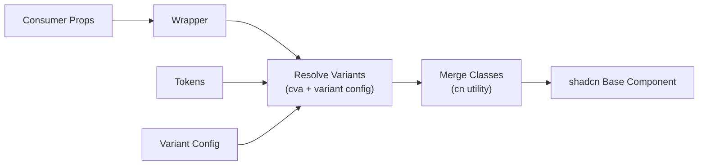

# Design Document: Design System

## Overview

This design defines a layered abstraction over shadcn/ui for syk-dashboard. The system introduces three architectural layers:

1. **Token System** (`src/design-system/tokens/`) — Abstract design values (spacing, typography, radius, shadows, z-index) as typed TypeScript constants
2. **Variant Configuration** (`src/design-system/variants/`) — Declarative variant-to-class mappings separated from component logic
3. **Wrapper Components** (`src/components/ui/`) — Consumer-facing components that compose shadcn/ui base components with the token/variant system

The architecture enforces a strict dependency direction: `Consumer → Wrapper → Base (shadcn)`. No consumer code may import directly from shadcn/ui internals.

### Key Design Decisions

- **No new runtime dependencies**: Use `clsx` + `tailwind-merge` (lightweight) for the `cn()` utility. Use a local `cva`-like helper built on the same primitives rather than adding `class-variance-authority` as a dependency.
- **CSS custom properties for theming**: All color tokens reference CSS variables defined in `globals.css`, ensuring theme changes require zero re-renders.
- **TypeScript-first**: Variant configs are typed Records. Invalid variant values are caught at compile time.
- **Incremental adoption**: Existing components (Button, Modal, DataTable, etc.) will be migrated to wrappers progressively. The old components remain functional during migration.

## Architecture

### Layer Diagram



### Data Flow



### File Structure

```
src/
├── design-system/
│   ├── tokens/
│   │   ├── spacing.ts
│   │   ├── typography.ts
│   │   ├── radius.ts
│   │   ├── shadows.ts
│   │   ├── zIndex.ts
│   │   └── index.ts          # Barrel (tokens only)
│   ├── variants/
│   │   ├── button.ts
│   │   ├── input.ts
│   │   ├── card.ts
│   │   ├── modal.ts
│   │   ├── badge.ts
│   │   ├── tabs.ts
│   │   ├── table.ts
│   │   └── index.ts          # Barrel (variants only)
│   ├── utils/
│   │   ├── cn.ts
│   │   ├── cva.ts
│   │   └── index.ts          # Barrel (utils only)
│   └── index.ts              # Top-level barrel
├── lib/
│   └── shadcn/
│       ├── button.tsx
│       ├── input.tsx
│       ├── card.tsx
│       ├── dialog.tsx
│       ├── badge.tsx
│       ├── tabs.tsx
│       └── table.tsx
├── components/
│   └── ui/
│       ├── Button.tsx
│       ├── Input.tsx
│       ├── Card.tsx
│       ├── Modal.tsx
│       ├── Badge.tsx
│       ├── Tabs.tsx
│       ├── Table.tsx
│       ├── FormField.tsx
│       └── index.ts          # Barrel export
```

## Components and Interfaces

### Token System

Each token category exports a typed constant object with abstract keys.

#### `src/design-system/tokens/spacing.ts`

```typescript
export const spacing = {
  xs: '0.25rem',   // 4px
  sm: '0.5rem',    // 8px
  md: '1rem',      // 16px
  lg: '1.5rem',    // 24px
  xl: '2rem',      // 32px
  '2xl': '3rem',   // 48px
} as const;

export type SpacingKey = keyof typeof spacing;
```

#### `src/design-system/tokens/typography.ts`

```typescript
export const fontSize = {
  xs: '0.75rem',    // 12px
  sm: '0.875rem',   // 14px
  md: '1rem',       // 16px
  lg: '1.125rem',   // 18px
  xl: '1.25rem',    // 20px
  '2xl': '1.5rem',  // 24px
} as const;

export const fontWeight = {
  normal: '400',
  medium: '500',
  semibold: '600',
  bold: '700',
} as const;

export const lineHeight = {
  tight: '1.25',
  normal: '1.5',
  relaxed: '1.75',
} as const;

export type FontSizeKey = keyof typeof fontSize;
export type FontWeightKey = keyof typeof fontWeight;
export type LineHeightKey = keyof typeof lineHeight;
```

#### `src/design-system/tokens/radius.ts`

```typescript
export const radius = {
  none: '0',
  sm: '0.375rem',   // 6px
  md: '0.5rem',     // 8px
  lg: '0.75rem',    // 12px
  xl: '1rem',       // 16px
  full: '9999px',
} as const;

export type RadiusKey = keyof typeof radius;
```

#### `src/design-system/tokens/shadows.ts`

```typescript
/** Maps to CSS custom properties defined in globals.css */
export const shadows = {
  none: 'none',
  soft: 'var(--shadow-soft)',
  elevated: 'var(--shadow-elevated)',
  glow: '0 0 12px rgba(192, 132, 160, 0.3)',
} as const;

export type ShadowKey = keyof typeof shadows;
```

#### `src/design-system/tokens/zIndex.ts`

```typescript
export const zIndex = {
  base: 0,
  dropdown: 100,
  sticky: 200,
  overlay: 500,
  modal: 1000,
  toast: 1100,
  tooltip: 1200,
} as const;

export type ZIndexKey = keyof typeof zIndex;
```

### Utility Functions

#### `src/design-system/utils/cn.ts`

```typescript
import { clsx, type ClassValue } from 'clsx';
import { twMerge } from 'tailwind-merge';

/**
 * Merges Tailwind CSS classes with conflict resolution.
 * Accepts conditional class expressions (falsy values are filtered).
 * Last-wins strategy for duplicate utilities.
 */
export function cn(...inputs: ClassValue[]): string {
  return twMerge(clsx(inputs));
}
```

#### `src/design-system/utils/cva.ts`

```typescript
import { cn } from './cn';

type ClassValue = string | undefined | null | false;

interface VariantConfig<V extends Record<string, Record<string, string>>> {
  base: string;
  variants: V;
  compoundVariants?: Array<
    Partial<{ [K in keyof V]: keyof V[K] }> & { class: string }
  >;
  defaultVariants: { [K in keyof V]: keyof V[K] };
}

type VariantProps<V extends Record<string, Record<string, string>>> = {
  [K in keyof V]?: keyof V[K];
};

interface CvaReturn<V extends Record<string, Record<string, string>>> {
  (props?: VariantProps<V> & { className?: string }): string;
  variants: V;
  defaultVariants: { [K in keyof V]: keyof V[K] };
}

/**
 * Creates a variant-aware class generator.
 * Resolves base + variant classes + compound variants + consumer className.
 */
export function cva<V extends Record<string, Record<string, string>>>(
  config: VariantConfig<V>,
): CvaReturn<V> {
  function resolver(props?: VariantProps<V> & { className?: string }): string {
    const resolvedProps = { ...config.defaultVariants, ...props };
    const { className, ...variantSelections } = resolvedProps as Record<string, unknown>;

    // Collect variant classes
    const variantClasses: string[] = [];
    for (const [axis, value] of Object.entries(variantSelections)) {
      const axisConfig = config.variants[axis as keyof V];
      if (axisConfig && value) {
        const cls = axisConfig[value as string];
        if (cls) variantClasses.push(cls);
      }
    }

    // Collect compound variant classes
    const compoundClasses: string[] = [];
    if (config.compoundVariants) {
      for (const compound of config.compoundVariants) {
        const { class: compoundClass, ...conditions } = compound;
        const matches = Object.entries(conditions).every(
          ([key, val]) => resolvedProps[key as keyof typeof resolvedProps] === val,
        );
        if (matches && compoundClass) {
          compoundClasses.push(compoundClass);
        }
      }
    }

    return cn(config.base, ...variantClasses, ...compoundClasses, className as ClassValue);
  }

  resolver.variants = config.variants;
  resolver.defaultVariants = config.defaultVariants;

  return resolver as CvaReturn<V>;
}

export type { VariantConfig, VariantProps, CvaReturn };
```

### Variant Configurations

#### `src/design-system/variants/button.ts`

```typescript
import { cva } from '@/design-system/utils/cva';

export const buttonVariants = cva({
  base: 'inline-flex items-center justify-center gap-2 font-medium whitespace-nowrap rounded-xl transition-all duration-150 focus-visible:ring-2 focus-visible:ring-accent focus-visible:ring-offset-2 focus-visible:ring-offset-bg-primary disabled:opacity-50 disabled:pointer-events-none',
  variants: {
    variant: {
      primary: 'bg-accent text-white hover:bg-accent/90',
      secondary: 'bg-transparent border border-secondary text-text-muted hover:border-accent-soft hover:text-text-primary',
      destructive: 'bg-destructive text-white hover:bg-destructive/90',
      ghost: 'bg-transparent text-text-muted hover:text-text-primary hover:bg-bg-secondary',
    },
    size: {
      sm: 'px-3 py-1.5 text-sm',
      md: 'px-4 py-2 text-base',
      lg: 'px-6 py-3 text-lg',
    },
  },
  defaultVariants: {
    variant: 'primary',
    size: 'md',
  },
});

export type ButtonVariant = keyof typeof buttonVariants.variants.variant;
export type ButtonSize = keyof typeof buttonVariants.variants.size;
```

#### `src/design-system/variants/badge.ts`

```typescript
import { cva } from '@/design-system/utils/cva';

export const badgeVariants = cva({
  base: 'inline-flex items-center rounded-full font-medium',
  variants: {
    variant: {
      default: 'bg-secondary/30 text-text-muted',
      success: 'bg-success-muted text-success',
      warning: 'bg-warning-muted text-warning',
      destructive: 'bg-destructive-muted text-destructive',
      outline: 'border border-secondary text-text-muted',
    },
    size: {
      sm: 'px-2 py-0.5 text-xs',
      md: 'px-2.5 py-0.5 text-sm',
    },
  },
  defaultVariants: {
    variant: 'default',
    size: 'md',
  },
});

export type BadgeVariant = keyof typeof badgeVariants.variants.variant;
export type BadgeSize = keyof typeof badgeVariants.variants.size;
```

#### `src/design-system/variants/card.ts`

```typescript
import { cva } from '@/design-system/utils/cva';

export const cardVariants = cva({
  base: 'rounded-2xl transition-shadow duration-150',
  variants: {
    variant: {
      default: 'bg-surface shadow-soft',
      elevated: 'bg-surface shadow-elevated',
      outlined: 'bg-surface border border-secondary/30',
    },
  },
  defaultVariants: {
    variant: 'default',
  },
});

export type CardVariant = keyof typeof cardVariants.variants.variant;
```

#### `src/design-system/variants/modal.ts`

```typescript
import { cva } from '@/design-system/utils/cva';

export const modalVariants = cva({
  base: 'w-full max-h-[85vh] flex flex-col bg-surface rounded-2xl shadow-elevated',
  variants: {
    size: {
      sm: 'max-w-[400px]',
      md: 'max-w-[520px]',
      lg: 'max-w-[720px]',
    },
  },
  defaultVariants: {
    size: 'md',
  },
});

export type ModalSize = keyof typeof modalVariants.variants.size;
```

### Wrapper Component Interfaces

#### `src/components/ui/Button.tsx`

```typescript
import type { ReactNode } from 'react';
import type { ButtonVariant, ButtonSize } from '@/design-system/variants/button';

export interface ButtonProps {
  variant?: ButtonVariant;
  size?: ButtonSize;
  loading?: boolean;
  disabled?: boolean;
  children: ReactNode;
  type?: 'button' | 'submit' | 'reset';
  onClick?: () => void;
  className?: string;
  'aria-label'?: string;
}

export function Button({
  variant,
  size,
  loading = false,
  disabled,
  children,
  type = 'button',
  onClick,
  className,
  'aria-label': ariaLabel,
}: ButtonProps): ReactNode;
```

#### `src/components/ui/Input.tsx`

```typescript
import type { ChangeEvent } from 'react';

export interface InputProps {
  label: string;
  error?: string;
  placeholder?: string;
  disabled?: boolean;
  value?: string;
  onChange?: (e: ChangeEvent<HTMLInputElement>) => void;
  type?: 'text' | 'email' | 'password' | 'number' | 'tel' | 'url';
  id?: string;
  name?: string;
}

export function Input(props: InputProps): ReactNode;
```

**ID generation**: When no explicit `id` is provided, the component generates one from the label using `label.toLowerCase().replace(/\s+/g, '-')` prefixed with `field-`.

#### `src/components/ui/Card.tsx`

```typescript
import type { ReactNode } from 'react';
import type { CardVariant } from '@/design-system/variants/card';

export interface CardProps {
  title?: string;
  description?: string;
  children: ReactNode;
  footer?: ReactNode;
  variant?: CardVariant;
  className?: string;
}

export function Card(props: CardProps): ReactNode;
```

#### `src/components/ui/Modal.tsx`

```typescript
import type { ReactNode } from 'react';
import type { ModalSize } from '@/design-system/variants/modal';

export interface ModalProps {
  open: boolean;
  onClose: () => void;
  title: string;
  description?: string;
  children: ReactNode;
  footer?: ReactNode;
  size?: ModalSize;
}

export function Modal(props: ModalProps): ReactNode;
```

#### `src/components/ui/Badge.tsx`

```typescript
import type { ReactNode } from 'react';
import type { BadgeVariant, BadgeSize } from '@/design-system/variants/badge';

export interface BadgeProps {
  variant?: BadgeVariant;
  size?: BadgeSize;
  children: ReactNode;
  className?: string;
}

export function Badge(props: BadgeProps): ReactNode;
```

#### `src/components/ui/Tabs.tsx`

```typescript
import type { ReactNode } from 'react';

export interface TabDefinition {
  value: string;
  label: string;
  content: ReactNode;
  disabled?: boolean;
}

export interface TabsProps {
  tabs: TabDefinition[];
  defaultValue?: string;
  value?: string;
  onValueChange?: (value: string) => void;
  className?: string;
}

export function Tabs(props: TabsProps): ReactNode;
```

#### `src/components/ui/Table.tsx`

```typescript
import type { ReactNode } from 'react';

export interface TableColumn<T> {
  key: keyof T | string;
  header: string;
  render?: (item: T) => ReactNode;
}

export interface TableProps<T> {
  columns: TableColumn<T>[];
  data: T[];
  onRowClick?: (item: T) => void;
  emptyMessage?: string;
  className?: string;
}

export function Table<T extends { id: string }>(props: TableProps<T>): ReactNode;
```

#### `src/components/ui/FormField.tsx`

```typescript
import type { ReactNode } from 'react';

export interface FormFieldProps {
  label: string;
  error?: string;
  children: ReactNode;
  htmlFor?: string;
  description?: string;
}

export function FormField(props: FormFieldProps): ReactNode;
```

**Deterministic ID pattern**: Error element ID = `${htmlFor}-error`. Description element ID = `${htmlFor}-description`. When no `htmlFor` is provided, it is derived from the label.

## Data Models

### Token Types (exported from `src/design-system/tokens/index.ts`)

```typescript
export type { SpacingKey } from './spacing';
export type { FontSizeKey, FontWeightKey, LineHeightKey } from './typography';
export type { RadiusKey } from './radius';
export type { ShadowKey } from './shadows';
export type { ZIndexKey } from './zIndex';
```

### Variant Types (exported from `src/design-system/variants/index.ts`)

```typescript
export type { ButtonVariant, ButtonSize } from './button';
export type { BadgeVariant, BadgeSize } from './badge';
export type { CardVariant } from './card';
export type { ModalSize } from './modal';
```

### Utility Types (from `src/design-system/utils/cva.ts`)

```typescript
/** Extracts variant props from a cva return type */
export type VariantProps<T> = T extends CvaReturn<infer V>
  ? { [K in keyof V]?: keyof V[K] }
  : never;
```

### Barrel Export (`src/components/ui/index.ts`)

```typescript
export { Button, type ButtonProps } from './Button';
export { Input, type InputProps } from './Input';
export { Card, type CardProps } from './Card';
export { Modal, type ModalProps } from './Modal';
export { Badge, type BadgeProps } from './Badge';
export { Tabs, type TabsProps, type TabDefinition } from './Tabs';
export { Table, type TableProps, type TableColumn } from './Table';
export { FormField, type FormFieldProps } from './FormField';
```

## Correctness Properties

*A property is a characteristic or behavior that should hold true across all valid executions of a system — essentially, a formal statement about what the system should do. Properties serve as the bridge between human-readable specifications and machine-verifiable correctness guarantees.*

### Property 1: Compound variant resolution produces valid classes

*For any* valid combination of variant axis values defined in a variant config, the `cva` resolver SHALL produce a non-empty string containing the base classes merged with the selected variant classes.

**Validates: Requirements 2.3**

### Property 2: Input label-to-id association

*For any* label string provided to the Input component, the rendered `<label>` element's `htmlFor` attribute SHALL match the rendered `<input>` element's `id` attribute, whether the `id` is explicitly provided or auto-generated.

**Validates: Requirements 4.4**

### Property 3: Tabs trigger count equals tab definitions length

*For any* non-empty array of `TabDefinition` objects, the Tabs component SHALL render exactly `N` tab trigger elements where `N` equals the length of the tabs array.

**Validates: Requirements 8.2**

### Property 4: Tabs ARIA linkage correctness

*For any* array of `TabDefinition` objects, each rendered tab trigger's `aria-controls` attribute SHALL reference the `id` of its corresponding tab panel, and each tab panel's `aria-labelledby` attribute SHALL reference the `id` of its corresponding trigger.

**Validates: Requirements 8.4**

### Property 5: Table renders headers matching column definitions

*For any* array of `TableColumn` definitions, the Table component SHALL render exactly one `<th>` element per column with text content matching the column's `header` property.

**Validates: Requirements 9.2**

### Property 6: Table custom cell rendering

*For any* column definition with a `render` function and any data row, the Table component SHALL display the output of calling `render(row)` in the corresponding cell, rather than the raw field value.

**Validates: Requirements 9.5**

### Property 7: FormField deterministic aria-describedby linkage

*For any* `htmlFor` value (or label-derived ID) and an error string, the FormField component SHALL set `aria-describedby` on its child to an ID that matches the error element's `id`, following the pattern `${htmlFor}-error`.

**Validates: Requirements 10.4**

### Property 8: Variant configs use only semantic token classes

*For any* variant config entry across all variant configurations, the class string SHALL NOT contain hardcoded hex color values (`#xxx`, `#xxxxxx`) or `rgb()`/`rgba()` literals — only Tailwind semantic utility classes that resolve via CSS custom properties.

**Validates: Requirements 12.2**

### Property 9: Token color pairs meet WCAG AA contrast

*For any* foreground/background color pair defined in the design token system for text rendering, the computed contrast ratio SHALL be ≥ 4.5:1 for normal text and ≥ 3:1 for large text.

**Validates: Requirements 13.1**

### Property 10: cn() last-wins conflict resolution

*For any* two Tailwind utility classes that target the same CSS property (e.g., `px-2` and `px-4`), when both are passed to `cn()`, the output SHALL contain only the last-provided class.

**Validates: Requirements 14.1, 14.2**

### Property 11: cn() filters falsy values

*For any* array of inputs mixing valid class strings with `null`, `undefined`, `false`, `0`, and empty strings, `cn()` SHALL produce output containing only the valid class strings (truthy values) with correct merging.

**Validates: Requirements 14.4**

## Error Handling

### Component-Level Error Handling

| Scenario | Behavior |
|----------|----------|
| Invalid variant value | TypeScript compiler error at build time (type narrowing via literal types) |
| Missing required props | TypeScript compiler error (no optional marker on required props) |
| Invalid children type | TypeScript compiler error (ReactNode type constraint) |
| Runtime className conflict | Resolved by `cn()` via tailwind-merge (last-wins) |

### Form Error Display Pattern

Components that display errors (`Input`, `FormField`) follow a consistent pattern:
1. Error message renders below the field with `role="alert"` for screen reader announcement
2. Error element has a deterministic ID for `aria-describedby` linkage
3. Destructive border style applied to the input when error is present
4. Error text uses `text-destructive` color token

### Modal Error States

- If `onClose` is not provided, the escape key and overlay click do nothing (defensive)
- If `open` is controlled externally and transitions rapidly, animations are interrupted gracefully via CSS `animation-fill-mode`

### Graceful Degradation

- If `clsx` or `tailwind-merge` fail to load, `cn()` falls back to simple string concatenation (unlikely in bundled app, but safe)
- If a variant value is `undefined` at runtime (e.g., from untyped API), the `cva` resolver applies `defaultVariants`

## Testing Strategy

### Dependencies

- **Vitest** — test runner (already installed)
- **fast-check** — property-based testing (already installed)
- **@testing-library/react** — component rendering (already installed)
- **@testing-library/jest-dom** — DOM matchers (already installed)

### Test Categories

#### Property-Based Tests (`*.property.test.ts`)

Target: Pure utility functions and variant resolution logic.

| Test File | Properties Covered |
|-----------|-------------------|
| `src/design-system/utils/cn.property.test.ts` | Properties 10, 11 |
| `src/design-system/utils/cva.property.test.ts` | Property 1 |
| `src/design-system/variants/variants.property.test.ts` | Property 8 |
| `src/design-system/tokens/contrast.property.test.ts` | Property 9 |

Property tests use `fast-check` with minimum 100 iterations per property. Each test is tagged:

```typescript
// Feature: design-system, Property 10: cn() last-wins conflict resolution
```

#### Component Tests (`*.test.tsx`)

Target: Wrapper component rendering, ARIA attributes, interaction behavior.

| Test File | Criteria Covered |
|-----------|-----------------|
| `src/components/ui/Button.test.tsx` | 3.1–3.8 |
| `src/components/ui/Input.test.tsx` | 4.1–4.5, Property 2 |
| `src/components/ui/Card.test.tsx` | 5.1–5.5 |
| `src/components/ui/Modal.test.tsx` | 6.1–6.7 |
| `src/components/ui/Badge.test.tsx` | 7.1–7.4 |
| `src/components/ui/Tabs.test.tsx` | 8.1–8.5, Properties 3, 4 |
| `src/components/ui/Table.test.tsx` | 9.1–9.5, Properties 5, 6 |
| `src/components/ui/FormField.test.tsx` | 10.1–10.4, Property 7 |

#### Architecture Tests

| Test | Criteria Covered |
|------|-----------------|
| ESLint `no-restricted-imports` rule | 11.1, 11.2 |
| Barrel export smoke test | 11.5 |

### Testing Approach

- **Unit tests** for specific component behaviors (rendering, clicks, ARIA)
- **Property tests** for universal properties across inputs (cn, cva, variant configs, ARIA linkage)
- Both approaches are complementary: unit tests catch specific regressions, property tests verify general correctness across the input space

### Property Test Configuration

```typescript
import * as fc from 'fast-check';

// Minimum 100 iterations for randomized coverage
const PBT_CONFIG = { numRuns: 100 };

it('property description', () => {
  fc.assert(
    fc.property(/* arbitraries */, (input) => {
      // assertion
    }),
    PBT_CONFIG,
  );
});
```

### New Dependencies Required

```json
{
  "dependencies": {
    "clsx": "^2.1.1",
    "tailwind-merge": "^2.6.0"
  }
}
```

These are lightweight (clsx: ~300B, tailwind-merge: ~6KB gzipped) and are the standard utilities for Tailwind class merging in the React ecosystem. No other new dependencies are needed.
