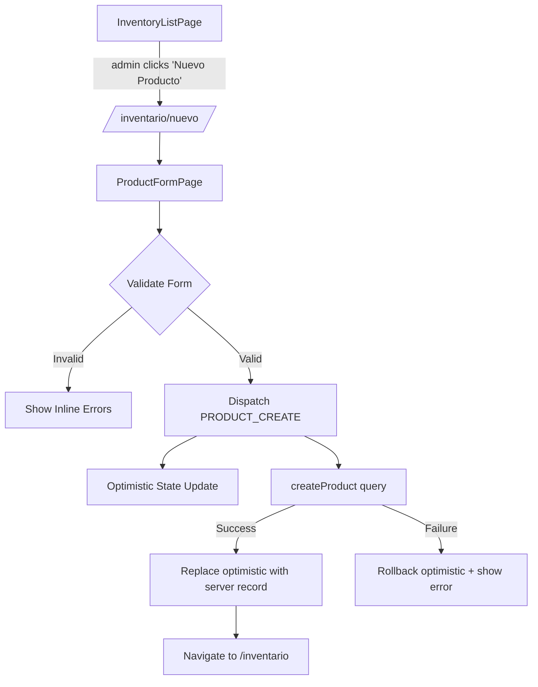
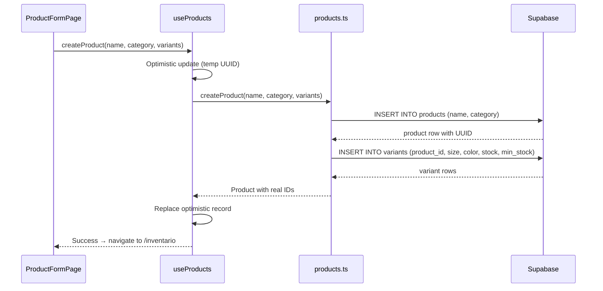

# Design Document — Product Creation

## Overview

This feature adds a product creation flow to the SYK Dashboard inventory module. Currently, the inventory section only allows viewing existing products and managing variants of already-created products. This design introduces a new `ProductFormPage` accessible from the inventory list (admin-only), a pure validation module (`productValidation.ts`), a Supabase query function for persisting products with variants, and an optimistic update mechanism in the state layer.

The design follows existing project patterns: lazy-loaded page component, pure validation functions, `useReducer` dispatch for state updates, and Supabase queries in `src/lib/queries/`.

## Architecture



### Key Design Decisions

1. **Pure validation module**: `productValidation.ts` follows the same pattern as `clientValidation.ts` and `formValidation.ts` — a pure function that returns `ValidationError[]`. This enables property-based testing.

2. **Single Supabase query function**: `createProduct` inserts the product row first, then inserts all variants in a single batch. If the product insert fails, no variants are attempted. If variant inserts partially fail, the error is surfaced to the user.

3. **New reducer action `PRODUCT_CREATE`**: Added to `DataAction` union type. The reducer creates an optimistic product with a temporary UUID. The hook reconciles after server response.

4. **Admin-only access via `RoleGate`**: The "Nuevo Producto" button uses the existing `RoleGate` component, consistent with how the variant-add form in `InventoryDetailPage` is gated.

## Components and Interfaces

### New Files

| File | Purpose |
|------|---------|
| `src/pages/ProductFormPage.tsx` | Page component with product creation form |
| `src/lib/productValidation.ts` | Pure validation function for product form data |

### Modified Files

| File | Change |
|------|--------|
| `src/App.tsx` | Add lazy import + route for `/inventario/nuevo` |
| `src/pages/InventoryListPage.tsx` | Add "Nuevo Producto" button (admin-only via `RoleGate`) |
| `src/types/actions.ts` | Add `PRODUCT_CREATE` action type |
| `src/lib/dataReducer.ts` | Handle `PRODUCT_CREATE` action |
| `src/lib/queries/products.ts` | Add `createProduct` function |
| `src/hooks/useProducts.ts` | Add `createProduct` method with optimistic update + rollback |

### Interfaces

```typescript
// src/lib/productValidation.ts
export interface ProductFormData {
  name: string;
  category: string;
  variants: VariantFormData[];
}

export interface VariantFormData {
  size: string;
  color: string;
  stock: number;
  minStock: number;
}

export function validateProductForm(data: ProductFormData): ValidationError[];
```

```typescript
// New action in src/types/actions.ts
| { type: 'PRODUCT_CREATE'; payload: { name: string; category: string; variants: Omit<Variant, 'id'>[] } }
```

```typescript
// New query in src/lib/queries/products.ts
export async function createProduct(
  name: string,
  category: string,
  variants: Omit<Variant, 'id'>[]
): Promise<Product>;
```

### ProductFormPage Component Structure

```typescript
// Internal state for the form
interface FormState {
  name: string;
  category: string;
  variants: Array<{
    key: string;  // React list key (crypto.randomUUID)
    size: string;
    color: string;
    stock: string;  // string for input binding, parsed to number on submit
    minStock: string;
  }>;
}
```

The form uses local `useState` for form fields (following the pattern in `InventoryDetailPage`), calls `validateProductForm` on submit, and dispatches to the data context on success.

## Data Models

### Existing Models (No Changes)

The `Product` and `Variant` types in `src/types/models.ts` already define the shape needed:

```typescript
interface Product {
  id: string;
  name: string;
  category: string;
  variants: Variant[];
}

interface Variant {
  id: string;
  size: string;
  color: string;
  stock: number;
  minStock: number;
}
```

### Database Schema (No Changes)

The `products` and `variants` tables already support the insert operations needed. The `variants.product_id` foreign key with `ON DELETE CASCADE` ensures referential integrity.

### Supabase Query Flow



## Correctness Properties

*A property is a characteristic or behavior that should hold true across all valid executions of a system — essentially, a formal statement about what the system should do. Properties serve as the bridge between human-readable specifications and machine-verifiable correctness guarantees.*

### Property 1: Valid product form data produces no validation errors

*For any* product form data where the name is non-empty (has at least one non-whitespace character), the category is non-empty (has at least one non-whitespace character), and there is at least one variant where size is non-empty, color is non-empty, stock ≥ 0, and minStock ≥ 0, the `validateProductForm` function SHALL return an empty error array.

**Validates: Requirements 7.2**

### Property 2: Empty required string fields produce field-specific errors

*For any* product form data where at least one required string field (name, category, variant size, or variant color) is empty or composed entirely of whitespace, the `validateProductForm` function SHALL return at least one error whose `field` identifier references the empty field.

**Validates: Requirements 3.1, 3.2, 3.3, 3.4, 7.3**

### Property 3: Negative numeric fields produce field-specific errors

*For any* product form data where at least one variant has a stock value < 0 or a minStock value < 0, the `validateProductForm` function SHALL return at least one error whose `field` identifier references the invalid variant field.

**Validates: Requirements 3.5, 3.6, 7.3**

### Property 4: Validation error count is monotonic with violations

*For any* product form data, the number of errors returned by `validateProductForm` SHALL be greater than or equal to the number of distinct field violations present in the input (each empty required field and each negative numeric field counts as one violation).

**Validates: Requirements 7.3**

## Error Handling

### Validation Errors (Client-Side)

- The `validateProductForm` function returns `ValidationError[]` with `field` and `message` properties.
- Field identifiers use dot notation for variants: `variants[0].size`, `variants[1].color`, etc.
- The form maps errors to inline messages using `aria-describedby` for accessibility.
- When validation fails, the form does NOT call the persistence layer.

### Persistence Errors (Server-Side)

| Scenario | Handling |
|----------|----------|
| Product insert fails | Display error toast/message, retain form data, no optimistic update rollback needed (it wasn't dispatched yet — the optimistic update happens simultaneously with the API call) |
| Variant insert partially fails | Display error indicating which variants failed, product was created but some variants may be missing |
| Network error | Display generic network error message, retain form data |

### Optimistic Update Rollback

The `useProducts` hook stores previous state in a `useRef` before applying the optimistic update (same pattern as existing `updateVariantStock` and `addVariant`). On failure, it reverts to the previous state and surfaces the error.

## Testing Strategy

### Property-Based Tests (fast-check)

File: `src/lib/productValidation.property.test.ts`

| Test | Property | Iterations |
|------|----------|-----------|
| Valid data → empty errors | Property 1 | 100 |
| Empty string fields → field-specific errors | Property 2 | 100 |
| Negative numerics → field-specific errors | Property 3 | 100 |
| Error count ≥ violation count | Property 4 | 100 |

Library: `fast-check` (already in project dependencies)

Each property test must:
- Run minimum 100 iterations (`{ numRuns: 100 }`)
- Include a tag comment referencing the design property
- Tag format: `Feature: product-creation, Property {N}: {title}`

### Unit Tests (Example-Based)

File: `src/pages/ProductFormPage.test.tsx`

| Test | Validates |
|------|-----------|
| Renders name and category fields | Req 2.1 |
| Renders at least one variant row on load | Req 2.3 |
| "Agregar Variante" adds a new row | Req 2.4 |
| Remove button removes a variant row | Req 2.5 |
| Remove button disabled when only one row | Req 2.6 |
| "Cancelar" navigates to /inventario | Req 2.8 |
| Displays inline errors on validation failure | Req 3.7 |
| Does not call API on validation failure | Req 3.8 |
| Navigates to /inventario on success | Req 4.3 |
| Shows error message on server failure | Req 4.4 |

### Integration Tests

| Test | Validates |
|------|-----------|
| "Nuevo Producto" button visible for admin only | Req 1.1, 1.3 |
| Route /inventario/nuevo is registered and protected | Req 1.4 |
| createProduct query inserts product + variants | Req 4.1, 4.2 |

### Accessibility Tests

| Test | Validates |
|------|-----------|
| All inputs have associated labels (htmlFor/id) | Req 6.1 |
| Error messages use aria-describedby | Req 6.2 |
| Tab order covers all interactive elements | Req 6.3 |
