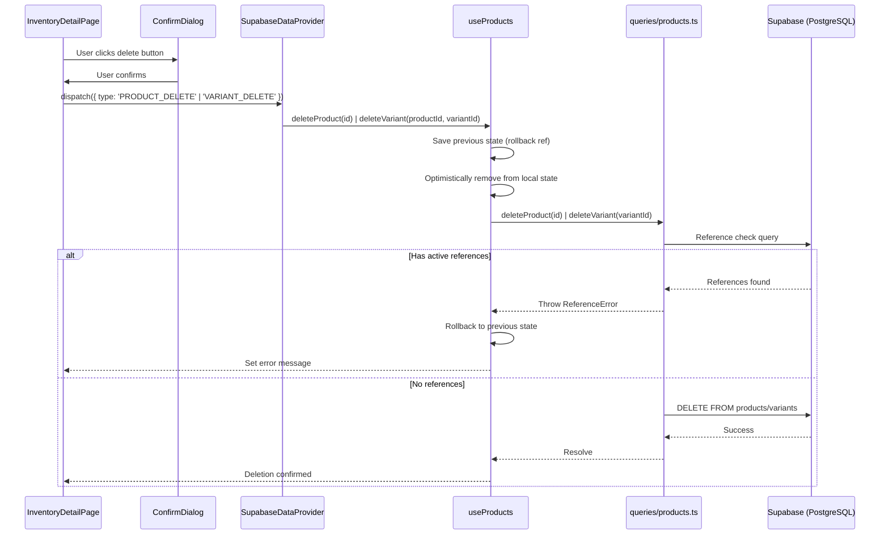
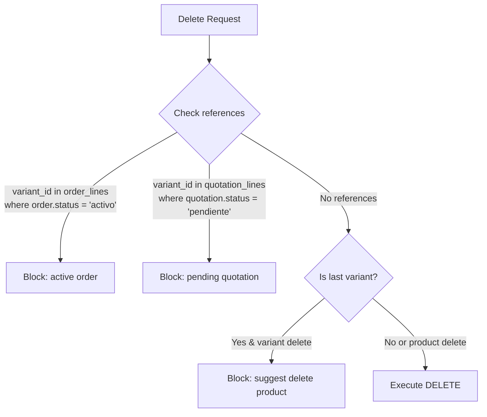

# Design Document: Product & Variant Deletion

## Overview

This feature adds deletion capabilities for products and individual variants within the inventory module. Deletions are admin-only operations enforced at both the UI layer (via `RoleGate`) and the database layer (via RLS policies). The system performs referential integrity checks before allowing deletion — products or variants that are referenced in active orders (`status = 'activo'`) or pending quotations (`status = 'pendiente'`) cannot be deleted. Additionally, the last variant of a product cannot be deleted individually (the admin must delete the entire product instead).

The implementation follows the existing optimistic update pattern established in `useProducts.ts`: apply the change to local state immediately, issue the Supabase mutation, and roll back on failure.

## Architecture

### Deletion Flow



### Reference Check Flow



## Components and Interfaces

### New Action Types (`src/types/actions.ts`)

```typescript
| { type: 'PRODUCT_DELETE'; payload: { id: string } }
| { type: 'VARIANT_DELETE'; payload: { productId: string; variantId: string } }
```

### New Query Functions (`src/lib/queries/products.ts`)

```typescript
export interface DeletionBlockReason {
  type: 'active_order' | 'pending_quotation' | 'last_variant';
  message: string;
}

/** Check if any variant of a product is referenced in active orders/pending quotations */
export async function checkProductReferences(productId: string): Promise<DeletionBlockReason | null>;

/** Check if a specific variant is referenced in active orders/pending quotations */
export async function checkVariantReferences(variantId: string): Promise<DeletionBlockReason | null>;

/** Delete a product (CASCADE removes variants). Caller must check references first. */
export async function deleteProduct(productId: string): Promise<void>;

/** Delete a single variant. Caller must check references and last-variant constraint first. */
export async function deleteVariant(variantId: string): Promise<void>;
```

### New Hook Methods (`src/hooks/useProducts.ts`)

```typescript
export interface UseProductsResult {
  // ... existing methods ...
  deleteProduct: (productId: string) => Promise<void>;
  deleteVariant: (productId: string, variantId: string) => Promise<void>;
}
```

### SupabaseDataProvider Dispatch Cases

Two new cases in the dispatch switch:

```typescript
case 'PRODUCT_DELETE':
  productsHook.deleteProduct(action.payload.id);
  break;

case 'VARIANT_DELETE':
  productsHook.deleteVariant(action.payload.productId, action.payload.variantId);
  break;
```

### DataReducer Cases (for offline/mock mode)

```typescript
case 'PRODUCT_DELETE': {
  const { id } = action.payload;
  return {
    ...state,
    products: state.products.filter((p) => p.id !== id),
  };
}

case 'VARIANT_DELETE': {
  const { productId, variantId } = action.payload;
  return {
    ...state,
    products: state.products.map((p) =>
      p.id === productId
        ? { ...p, variants: p.variants.filter((v) => v.id !== variantId) }
        : p
    ),
  };
}
```

### UI Changes (`src/pages/InventoryDetailPage.tsx`)

1. **Delete Product Button** — A destructive button in the header area, wrapped in `<RoleGate allowedRoles={['admin']}>`. Opens `ConfirmDialog` with `variant="destructive"`.

2. **Delete Variant Button** — A new column in the variant `DataTable` with a trash icon button per row, wrapped in `<RoleGate>`. Opens `ConfirmDialog` identifying the variant by size/color.

3. **Error Display** — A toast or inline alert displayed when deletion is blocked due to references or the last-variant constraint.

### RLS Migration (`supabase/migrations/006_delete_policies.sql`)

```sql
-- Products: only admin can delete (admin_all already covers FOR ALL)
-- But explicit DELETE policies for variants to ensure non-admin cannot delete
CREATE POLICY products_delete_admin ON products
  FOR DELETE USING (get_user_role() = 'admin');

CREATE POLICY variants_delete_admin ON variants
  FOR DELETE USING (get_user_role() = 'admin');
```

> Note: The existing `admin_all` policies on both tables already grant `FOR ALL` to admin users, so these explicit policies are redundant but serve as defense-in-depth documentation. In practice, only the `admin_all` policy is needed. We will verify this during implementation and may skip this migration if the existing policies suffice.

## Data Models

### Existing Schema (relevant tables)

| Table | Key Columns | Relevant Constraints |
|-------|-------------|---------------------|
| `products` | `id UUID PK` | — |
| `variants` | `id UUID PK`, `product_id FK → products(id) ON DELETE CASCADE` | — |
| `order_lines` | `variant_id FK → variants(id)`, `order_id FK → orders(id)` | — |
| `quotation_lines` | `variant_id FK → variants(id)`, `quotation_id FK → quotations(id)` | — |
| `orders` | `id UUID PK`, `status TEXT` | `CHECK (status IN ('activo', 'entregado'))` |
| `quotations` | `id UUID PK`, `status TEXT` | `CHECK (status IN ('borrador', 'pendiente', 'aprobada', 'rechazada'))` |

### Reference Check Queries

**Product reference check** — A product is blocked if ANY of its variants appears in:
- `order_lines` joined to `orders` where `orders.status = 'activo'`
- `quotation_lines` joined to `quotations` where `quotations.status = 'pendiente'`

```sql
SELECT EXISTS (
  SELECT 1 FROM order_lines ol
  JOIN orders o ON ol.order_id = o.id
  JOIN variants v ON ol.variant_id = v.id
  WHERE v.product_id = $1 AND o.status = 'activo'
) AS has_active_orders;

SELECT EXISTS (
  SELECT 1 FROM quotation_lines ql
  JOIN quotations q ON ql.quotation_id = q.id
  JOIN variants v ON ql.variant_id = v.id
  WHERE v.product_id = $1 AND q.status = 'pendiente'
) AS has_pending_quotations;
```

**Variant reference check** — A variant is blocked if it appears in:
- `order_lines` joined to `orders` where `orders.status = 'activo'`
- `quotation_lines` joined to `quotations` where `quotations.status = 'pendiente'`

```sql
SELECT EXISTS (
  SELECT 1 FROM order_lines ol
  JOIN orders o ON ol.order_id = o.id
  WHERE ol.variant_id = $1 AND o.status = 'activo'
) AS has_active_orders;

SELECT EXISTS (
  SELECT 1 FROM quotation_lines ql
  JOIN quotations q ON ql.quotation_id = q.id
  WHERE ql.variant_id = $1 AND q.status = 'pendiente'
) AS has_pending_quotations;
```

### Domain Types for Deletion

```typescript
export interface DeletionBlockReason {
  type: 'active_order' | 'pending_quotation' | 'last_variant';
  message: string;
}
```

The `message` field contains user-facing text in Spanish (consistent with UI language).


## Correctness Properties

*A property is a characteristic or behavior that should hold true across all valid executions of a system — essentially, a formal statement about what the system should do. Properties serve as the bridge between human-readable specifications and machine-verifiable correctness guarantees.*

### Property 1: Product deletion removes product and all its variants from state

*For any* valid `AppData` state containing a product with any number of variants, when a `PRODUCT_DELETE` action is dispatched for that product, the resulting state SHALL NOT contain the product in the products array, and no variant belonging to that product shall exist in any remaining product's variants.

**Validates: Requirements 1.2**

### Property 2: Variant deletion removes only the targeted variant

*For any* valid `AppData` state containing a product with two or more variants, when a `VARIANT_DELETE` action is dispatched for one specific variant, the resulting state SHALL contain the same product with exactly one fewer variant, the removed variant SHALL be the one targeted, and all other variants SHALL remain unchanged.

**Validates: Requirements 2.2**

### Property 3: Optimistic deletion rollback restores original state

*For any* valid product list, if a product (or variant) is optimistically removed from the list and then the rollback is applied (restoring from the saved reference), the resulting list SHALL be deeply equal to the original list before the optimistic removal.

**Validates: Requirements 1.4, 2.4**

### Property 4: Product reference check is blocked if and only if variants are in active orders or pending quotations

*For any* `AppData` state and any product within it, the reference check function SHALL return a block reason if and only if at least one variant of that product appears as a `variantId` in the lines of an order with `status = 'activo'` or a quotation with `status = 'pendiente'`.

**Validates: Requirements 3.1, 3.2**

### Property 5: Variant reference check is blocked if and only if variant is in active orders or pending quotations

*For any* `AppData` state and any variant within it, the reference check function SHALL return a block reason if and only if that variant's ID appears as a `variantId` in the lines of an order with `status = 'activo'` or a quotation with `status = 'pendiente'`.

**Validates: Requirements 4.1, 4.2**

### Property 6: Last-variant guard blocks if and only if product has exactly one variant

*For any* product, the last-variant check SHALL block deletion if and only if the product's variants array has length exactly 1. When the product has 2 or more variants, the check SHALL allow deletion.

**Validates: Requirements 5.1, 5.2**

## Error Handling

### Error Categories

| Error | Source | User-Facing Message (ES) | Recovery |
|-------|--------|--------------------------|----------|
| Active order reference | `checkProductReferences` / `checkVariantReferences` | "No se puede eliminar: este {producto/variante} está referenciado en pedidos activos." | Inform user, no state change |
| Pending quotation reference | `checkProductReferences` / `checkVariantReferences` | "No se puede eliminar: este {producto/variante} está referenciado en cotizaciones pendientes." | Inform user, no state change |
| Last variant | Pre-check in hook | "No se puede eliminar la última variante. Elimina el producto completo en su lugar." | Inform user, no state change |
| Network/Supabase error | DELETE query failure | "Error al eliminar. Intenta nuevamente." | Rollback optimistic update, show error |
| RLS permission denied | Supabase 403/42501 | "No tienes permisos para realizar esta acción." | Rollback optimistic update, show error |

### Error Flow

1. **Pre-deletion checks** (reference check + last-variant check) happen BEFORE any optimistic state change. If blocked, the system shows a blocking message in a dialog and does NOT modify state.

2. **Network failures** happen AFTER the optimistic update is applied. On failure, the hook restores state from `previousStateRef.current` and sets the error message.

3. **Error display** — Errors from blocking checks are shown in the ConfirmDialog itself (dialog stays open with an error banner). Network errors after optimistic failure are shown as an inline error message near the action area (consistent with how `useProducts` already exposes `error` state).

### Optimistic Update + Rollback Pattern

```typescript
// Product deletion
const deleteProduct = useCallback(async (productId: string) => {
  previousStateRef.current = products;
  setProducts(prev => prev.filter(p => p.id !== productId));

  try {
    const blockReason = await productQueries.checkProductReferences(productId);
    if (blockReason) {
      setProducts(previousStateRef.current); // rollback
      throw new DeletionBlockedError(blockReason.message);
    }
    await productQueries.deleteProduct(productId);
  } catch (e) {
    setProducts(previousStateRef.current); // rollback
    setError(e instanceof Error ? e.message : 'Error al eliminar producto');
    throw e;
  }
}, [products]);
```

> Note: An alternative is to check references BEFORE optimistic removal to avoid the flash of content disappearing then reappearing. This is the preferred UX: check first, then optimistically remove only if the check passes. The final implementation will perform the reference check first, only applying optimistic removal after the check passes.

### Revised Flow (check-first approach)

```typescript
const deleteProduct = useCallback(async (productId: string) => {
  // 1. Check references (no optimistic update yet)
  const blockReason = await productQueries.checkProductReferences(productId);
  if (blockReason) {
    throw new DeletionBlockedError(blockReason.message);
  }

  // 2. Now apply optimistic removal
  previousStateRef.current = products;
  setProducts(prev => prev.filter(p => p.id !== productId));

  try {
    await productQueries.deleteProduct(productId);
  } catch (e) {
    // 3. Rollback on network failure
    setProducts(previousStateRef.current);
    setError(e instanceof Error ? e.message : 'Error al eliminar producto');
    throw e;
  }
}, [products]);
```

## Testing Strategy

### Property-Based Tests (fast-check)

Property-based tests will use **fast-check** (already installed in the project) with a minimum of **100 iterations** per property.

| Property | Test File | What's Generated |
|----------|-----------|-----------------|
| 1: Product deletion | `src/lib/dataReducer.property.test.ts` | Random `AppData` with 1-10 products, each with 1-5 variants |
| 2: Variant deletion | `src/lib/dataReducer.property.test.ts` | Random products with 2+ variants, pick random variant to delete |
| 3: Rollback | `src/hooks/useProducts.property.test.ts` | Random product arrays, simulate optimistic removal + rollback |
| 4: Product reference check | `src/lib/queries/products.property.test.ts` | Random state with orders/quotations, check reference function correctness |
| 5: Variant reference check | `src/lib/queries/products.property.test.ts` | Random state with orders/quotations, check reference function correctness |
| 6: Last-variant guard | `src/lib/queries/products.property.test.ts` | Random products with 1-5 variants, verify guard behavior |

Each test will be tagged with a comment:
```typescript
// Feature: product-variant-deletion, Property 1: Product deletion removes product and all its variants from state
```

### Unit Tests (example-based)

| Scenario | Test File |
|----------|-----------|
| ConfirmDialog shows product name | `src/pages/InventoryDetailPage.test.tsx` |
| ConfirmDialog shows variant size/color | `src/pages/InventoryDetailPage.test.tsx` |
| Delete button hidden for vendedor role | `src/pages/InventoryDetailPage.test.tsx` |
| Error message displayed on block | `src/pages/InventoryDetailPage.test.tsx` |
| Navigate to list after product deletion | `src/pages/InventoryDetailPage.test.tsx` |

### Integration Tests

| Scenario | Description |
|----------|-------------|
| RLS blocks vendedor DELETE on products | Attempt DELETE as vendedor, expect 403 |
| RLS blocks vendedor DELETE on variants | Attempt DELETE as vendedor, expect 403 |
| CASCADE deletes variants with product | Delete product, verify variants are gone |
| Reference check queries return correct results | Insert test data, verify check functions |

### Test Configuration

- Fast-check property tests: `numRuns: 100` minimum
- Vitest as runner: `pnpm test` (vitest --run)
- Co-located test files following existing patterns
