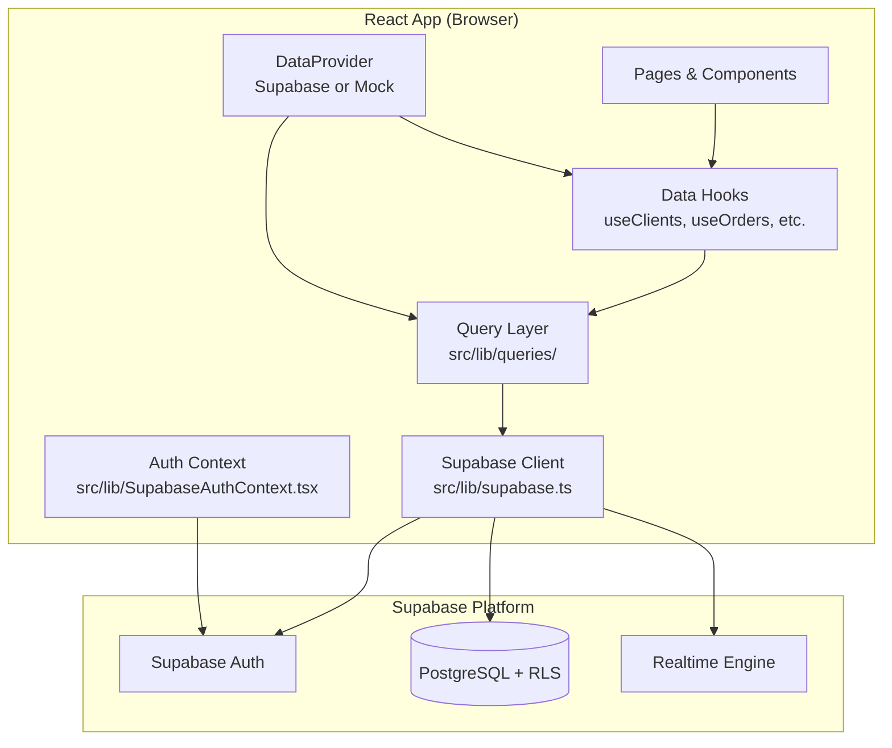
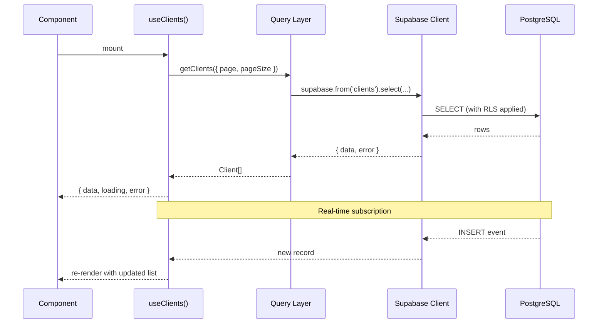
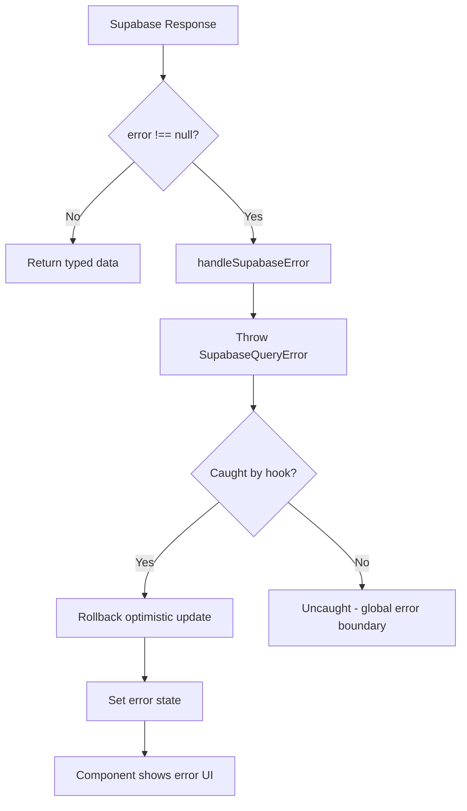

# Design Document — Supabase Integration

## Overview

This design describes the integration of Supabase as the backend for syk-dashboard, replacing the current in-memory `DataContext` + mock data approach. The frontend React app connects directly to Supabase (no intermediate API server) for authentication, data persistence, authorization (RLS), and real-time updates.

### Key Design Goals

- **Backward compatibility**: Existing components continue to work unchanged through a `DataProvider` abstraction
- **Gradual migration**: Fallback to mock data when Supabase env vars are not configured
- **Type safety**: Generated types from the database schema ensure compile-time correctness
- **Performance**: Optimistic updates, request deduplication, and selective projections minimize latency
- **Security**: Row Level Security at the database level enforces role-based access without client-side trust

### Technology Choices

| Concern | Solution |
|---------|----------|
| SDK | `@supabase/supabase-js` v2 |
| Auth | Supabase Auth (email/password) |
| Database | PostgreSQL via Supabase |
| Real-time | Supabase Realtime (PostgreSQL changes) |
| Type gen | `supabase gen types typescript` |
| Testing | Vitest + fast-check (property-based) |

---

## Architecture

### High-Level System Diagram



### Data Flow



### Module Architecture

```
src/
├── lib/
│   ├── supabase.ts              # Singleton client
│   ├── SupabaseAuthContext.tsx   # Supabase-backed auth provider
│   ├── SupabaseDataProvider.tsx  # Supabase-backed data provider
│   ├── DataContext.tsx           # Original mock-backed provider (unchanged)
│   ├── DataProvider.tsx          # Facade that selects Supabase vs Mock
│   ├── queries/
│   │   ├── clients.ts           # Client CRUD operations
│   │   ├── products.ts          # Product/variant operations
│   │   ├── quotations.ts        # Quotation operations
│   │   ├── orders.ts            # Order operations
│   │   └── shared.ts            # Shared utilities (error handling, pagination)
│   └── realtime/
│       ├── useRealtimeSubscription.ts  # Generic subscription hook
│       └── channels.ts                 # Channel configuration
├── hooks/
│   ├── useClients.ts            # Client data hook
│   ├── useProducts.ts           # Product data hook
│   ├── useQuotations.ts         # Quotation data hook
│   ├── useOrders.ts             # Order data hook
│   ├── useSupabaseAuth.ts       # Auth hook for Supabase
│   └── useDataScope.ts          # Existing role-based scoping (unchanged)
├── types/
│   ├── database.ts              # Generated from Supabase schema
│   ├── models.ts                # Application domain models (unchanged)
│   └── auth.ts                  # Auth types (extended)
```

---

## Components and Interfaces

### 1. Supabase Client (`src/lib/supabase.ts`)

```typescript
import { createClient, SupabaseClient } from '@supabase/supabase-js';
import type { Database } from '@/types/database';

const supabaseUrl = import.meta.env.VITE_SUPABASE_URL;
const supabaseKey = import.meta.env.VITE_SUPABASE_PUBLISHABLE_KEY;

if (!supabaseUrl || !supabaseKey) {
  throw new Error(
    `Missing Supabase environment variables. ` +
    `Ensure VITE_SUPABASE_URL and VITE_SUPABASE_PUBLISHABLE_KEY are set.`
  );
}

if (!supabaseUrl.match(/^https:\/\/.*\.supabase\.co$/)) {
  console.warn('[Supabase] URL may be invalid. Expected pattern: https://*.supabase.co');
}

export const supabase: SupabaseClient<Database> = createClient<Database>(
  supabaseUrl,
  supabaseKey,
  {
    auth: {
      persistSession: true,
      autoRefreshToken: true,
    },
  }
);
```

### 2. Auth Context (`src/lib/SupabaseAuthContext.tsx`)

```typescript
export interface SupabaseAuthState {
  user: User | null;
  isAuthenticated: boolean;
  loading: boolean;
}

export interface SupabaseAuthContextValue {
  state: SupabaseAuthState;
  login: (email: string, password: string) => Promise<{ error: string | null }>;
  logout: () => Promise<void>;
}
```

Key behaviors:
- Listens to `onAuthStateChange` for `SIGNED_IN`, `SIGNED_OUT`, `TOKEN_REFRESHED`
- Extracts role from `user.user_metadata.role`
- Maps Supabase `User` to application `User` type
- Exposes `loading` state for initial session restoration

### 3. DataProvider Facade (`src/lib/DataProvider.tsx`)

```typescript
export function DataProvider({ children }: { children: ReactNode }) {
  const isSupabaseConfigured = Boolean(
    import.meta.env.VITE_SUPABASE_URL &&
    import.meta.env.VITE_SUPABASE_PUBLISHABLE_KEY
  );

  if (isSupabaseConfigured) {
    return <SupabaseDataProvider>{children}</SupabaseDataProvider>;
  }

  return <MockDataProvider>{children}</MockDataProvider>;
}
```

### 4. Query Layer (`src/lib/queries/shared.ts`)

```typescript
export interface PaginationParams {
  page?: number;
  pageSize?: number;
}

export interface PaginatedResult<T> {
  data: T[];
  count: number;
  page: number;
  pageSize: number;
}

export class SupabaseQueryError extends Error {
  constructor(
    message: string,
    public readonly code: string | null,
    public readonly details: string | null
  ) {
    super(message);
    this.name = 'SupabaseQueryError';
  }
}

export function handleSupabaseError(error: { message: string; code?: string; details?: string }): never {
  throw new SupabaseQueryError(error.message, error.code ?? null, error.details ?? null);
}

export function paginationRange(params: PaginationParams): { from: number; to: number } {
  const page = params.page ?? 1;
  const pageSize = params.pageSize ?? 50;
  const from = (page - 1) * pageSize;
  const to = from + pageSize - 1;
  return { from, to };
}
```

### 5. Query Functions (example: `src/lib/queries/clients.ts`)

```typescript
import { supabase } from '@/lib/supabase';
import type { Client } from '@/types/models';
import type { PaginationParams, PaginatedResult } from './shared';
import { handleSupabaseError, paginationRange } from './shared';

export async function getClients(params: PaginationParams = {}): Promise<PaginatedResult<Client>> {
  const { from, to } = paginationRange(params);

  const { data, error, count } = await supabase
    .from('clients')
    .select('id, name, email, phone', { count: 'exact' })
    .range(from, to)
    .order('name');

  if (error) handleSupabaseError(error);

  return {
    data: data ?? [],
    count: count ?? 0,
    page: params.page ?? 1,
    pageSize: params.pageSize ?? 50,
  };
}

export async function createClient(client: Omit<Client, 'id'>): Promise<Client> {
  const { data, error } = await supabase
    .from('clients')
    .insert(client)
    .select('id, name, email, phone')
    .single();

  if (error) handleSupabaseError(error);
  return data!;
}

export async function updateClient(id: string, changes: Partial<Omit<Client, 'id'>>): Promise<Client> {
  const { data, error } = await supabase
    .from('clients')
    .update(changes)
    .eq('id', id)
    .select('id, name, email, phone')
    .single();

  if (error) handleSupabaseError(error);
  return data!;
}

export async function deleteClient(id: string): Promise<void> {
  const { error } = await supabase.from('clients').delete().eq('id', id);
  if (error) handleSupabaseError(error);
}
```

### 6. Data Hook Pattern (example: `src/hooks/useClients.ts`)

```typescript
import { useState, useEffect, useCallback, useRef } from 'react';
import type { Client } from '@/types/models';
import * as clientQueries from '@/lib/queries/clients';
import { useRealtimeSubscription } from '@/lib/realtime/useRealtimeSubscription';

interface UseClientsResult {
  clients: Client[];
  loading: boolean;
  error: string | null;
  refetch: () => void;
  createClient: (client: Omit<Client, 'id'>) => Promise<void>;
  updateClient: (id: string, changes: Partial<Omit<Client, 'id'>>) => Promise<void>;
  deleteClient: (id: string) => Promise<void>;
}

export function useClients(): UseClientsResult {
  const [clients, setClients] = useState<Client[]>([]);
  const [loading, setLoading] = useState(true);
  const [error, setError] = useState<string | null>(null);
  const previousState = useRef<Client[]>([]);

  // Fetch initial data
  const fetch = useCallback(async () => { /* ... */ }, []);

  // Optimistic create
  const createClient = useCallback(async (input: Omit<Client, 'id'>) => {
    const optimistic: Client = { ...input, id: crypto.randomUUID() };
    previousState.current = clients;
    setClients(prev => [...prev, optimistic]);

    try {
      const created = await clientQueries.createClient(input);
      setClients(prev => prev.map(c => c.id === optimistic.id ? created : c));
    } catch (e) {
      setClients(previousState.current); // rollback
      setError(e instanceof Error ? e.message : 'Error creating client');
    }
  }, [clients]);

  // Real-time subscription
  useRealtimeSubscription('clients', {
    onInsert: (record) => setClients(prev => [...prev, record as Client]),
    onUpdate: (record) => setClients(prev => prev.map(c => c.id === record.id ? { ...c, ...record } as Client : c)),
    onDelete: (old) => setClients(prev => prev.filter(c => c.id !== old.id)),
  });

  return { clients, loading, error, refetch: fetch, createClient, updateClient, deleteClient };
}
```

### 7. Real-time Subscription Hook (`src/lib/realtime/useRealtimeSubscription.ts`)

```typescript
import { useEffect, useRef } from 'react';
import { supabase } from '@/lib/supabase';
import type { RealtimeChannel } from '@supabase/supabase-js';

interface SubscriptionCallbacks {
  onInsert?: (record: Record<string, unknown>) => void;
  onUpdate?: (record: Record<string, unknown>) => void;
  onDelete?: (oldRecord: Record<string, unknown>) => void;
}

export function useRealtimeSubscription(table: string, callbacks: SubscriptionCallbacks): void {
  const channelRef = useRef<RealtimeChannel | null>(null);

  useEffect(() => {
    const channel = supabase
      .channel(`${table}-changes`)
      .on('postgres_changes', { event: 'INSERT', schema: 'public', table }, (payload) => {
        callbacks.onInsert?.(payload.new);
      })
      .on('postgres_changes', { event: 'UPDATE', schema: 'public', table }, (payload) => {
        callbacks.onUpdate?.(payload.new);
      })
      .on('postgres_changes', { event: 'DELETE', schema: 'public', table }, (payload) => {
        callbacks.onDelete?.(payload.old);
      })
      .subscribe();

    channelRef.current = channel;

    return () => {
      supabase.removeChannel(channel);
    };
  }, [table]);
}
```

### 8. Request Deduplication (`src/lib/queries/shared.ts`)

```typescript
const pendingRequests = new Map<string, Promise<unknown>>();

export function deduplicateRequest<T>(key: string, factory: () => Promise<T>): Promise<T> {
  const existing = pendingRequests.get(key);
  if (existing) return existing as Promise<T>;

  const promise = factory().finally(() => {
    pendingRequests.delete(key);
  });

  pendingRequests.set(key, promise);
  return promise;
}
```

---

## Data Models

### Database Schema (PostgreSQL)

```sql
-- Enable UUID extension
CREATE EXTENSION IF NOT EXISTS "uuid-ossp";

-- ===========================
-- Clients
-- ===========================
CREATE TABLE clients (
  id UUID PRIMARY KEY DEFAULT uuid_generate_v4(),
  name TEXT NOT NULL,
  email TEXT NOT NULL,
  phone TEXT NOT NULL,
  created_at TIMESTAMPTZ DEFAULT now(),
  updated_at TIMESTAMPTZ DEFAULT now()
);

-- ===========================
-- Products
-- ===========================
CREATE TABLE products (
  id UUID PRIMARY KEY DEFAULT uuid_generate_v4(),
  name TEXT NOT NULL,
  category TEXT NOT NULL,
  created_at TIMESTAMPTZ DEFAULT now(),
  updated_at TIMESTAMPTZ DEFAULT now()
);

-- ===========================
-- Variants
-- ===========================
CREATE TABLE variants (
  id UUID PRIMARY KEY DEFAULT uuid_generate_v4(),
  product_id UUID NOT NULL REFERENCES products(id) ON DELETE CASCADE,
  size TEXT NOT NULL,
  color TEXT NOT NULL,
  stock INTEGER NOT NULL DEFAULT 0 CHECK (stock >= 0),
  min_stock INTEGER NOT NULL DEFAULT 0 CHECK (min_stock >= 0),
  created_at TIMESTAMPTZ DEFAULT now()
);

-- ===========================
-- Quotations
-- ===========================
CREATE TABLE quotations (
  id UUID PRIMARY KEY DEFAULT uuid_generate_v4(),
  number TEXT NOT NULL UNIQUE,
  client_id UUID NOT NULL REFERENCES clients(id),
  seller_id UUID NOT NULL REFERENCES auth.users(id),
  total NUMERIC(12,2) NOT NULL DEFAULT 0,
  status TEXT NOT NULL DEFAULT 'borrador'
    CHECK (status IN ('borrador', 'pendiente', 'aprobada', 'rechazada')),
  notes TEXT DEFAULT '',
  estimated_delivery_date DATE,
  created_at TIMESTAMPTZ DEFAULT now(),
  updated_at TIMESTAMPTZ DEFAULT now()
);

-- ===========================
-- Quotation Lines
-- ===========================
CREATE TABLE quotation_lines (
  id UUID PRIMARY KEY DEFAULT uuid_generate_v4(),
  quotation_id UUID NOT NULL REFERENCES quotations(id) ON DELETE CASCADE,
  product_id UUID NOT NULL REFERENCES products(id),
  variant_id UUID NOT NULL REFERENCES variants(id),
  quantity INTEGER NOT NULL CHECK (quantity > 0),
  unit_price NUMERIC(12,2) NOT NULL CHECK (unit_price >= 0),
  subtotal NUMERIC(12,2) NOT NULL CHECK (subtotal >= 0)
);

-- ===========================
-- Orders
-- ===========================
CREATE TABLE orders (
  id UUID PRIMARY KEY DEFAULT uuid_generate_v4(),
  number TEXT NOT NULL UNIQUE,
  client_id UUID NOT NULL REFERENCES clients(id),
  seller_id UUID NOT NULL REFERENCES auth.users(id),
  total NUMERIC(12,2) NOT NULL DEFAULT 0,
  status TEXT NOT NULL DEFAULT 'activo'
    CHECK (status IN ('activo', 'entregado')),
  notes TEXT DEFAULT '',
  due_date DATE NOT NULL,
  quotation_id UUID REFERENCES quotations(id),
  created_at TIMESTAMPTZ DEFAULT now(),
  updated_at TIMESTAMPTZ DEFAULT now()
);

-- ===========================
-- Order Lines
-- ===========================
CREATE TABLE order_lines (
  id UUID PRIMARY KEY DEFAULT uuid_generate_v4(),
  order_id UUID NOT NULL REFERENCES orders(id) ON DELETE CASCADE,
  product_id UUID NOT NULL REFERENCES products(id),
  variant_id UUID NOT NULL REFERENCES variants(id),
  quantity INTEGER NOT NULL CHECK (quantity > 0),
  unit_price NUMERIC(12,2) NOT NULL CHECK (unit_price >= 0),
  subtotal NUMERIC(12,2) NOT NULL CHECK (subtotal >= 0)
);

-- ===========================
-- Deposits
-- ===========================
CREATE TABLE deposits (
  id UUID PRIMARY KEY DEFAULT uuid_generate_v4(),
  order_id UUID NOT NULL REFERENCES orders(id) ON DELETE CASCADE,
  amount NUMERIC(12,2) NOT NULL CHECK (amount > 0),
  method TEXT NOT NULL CHECK (method IN ('transferencia', 'efectivo')),
  date DATE NOT NULL,
  created_at TIMESTAMPTZ DEFAULT now()
);

-- ===========================
-- Indexes
-- ===========================
CREATE INDEX idx_variants_product_id ON variants(product_id);
CREATE INDEX idx_quotations_seller_id ON quotations(seller_id);
CREATE INDEX idx_quotations_client_id ON quotations(client_id);
CREATE INDEX idx_orders_seller_id ON orders(seller_id);
CREATE INDEX idx_orders_client_id ON orders(client_id);
CREATE INDEX idx_quotation_lines_quotation_id ON quotation_lines(quotation_id);
CREATE INDEX idx_order_lines_order_id ON order_lines(order_id);
CREATE INDEX idx_deposits_order_id ON deposits(order_id);
```

### Row Level Security Policies

```sql
-- Helper function to read user role from metadata
CREATE OR REPLACE FUNCTION get_user_role()
RETURNS TEXT AS $$
  SELECT coalesce(
    (auth.jwt() -> 'user_metadata' ->> 'role'),
    ''
  );
$$ LANGUAGE SQL STABLE SECURITY DEFINER;

-- Enable RLS on all tables
ALTER TABLE clients ENABLE ROW LEVEL SECURITY;
ALTER TABLE products ENABLE ROW LEVEL SECURITY;
ALTER TABLE variants ENABLE ROW LEVEL SECURITY;
ALTER TABLE quotations ENABLE ROW LEVEL SECURITY;
ALTER TABLE quotation_lines ENABLE ROW LEVEL SECURITY;
ALTER TABLE orders ENABLE ROW LEVEL SECURITY;
ALTER TABLE order_lines ENABLE ROW LEVEL SECURITY;
ALTER TABLE deposits ENABLE ROW LEVEL SECURITY;

-- Admin: full access to everything
CREATE POLICY admin_all ON clients FOR ALL USING (get_user_role() = 'admin');
CREATE POLICY admin_all ON products FOR ALL USING (get_user_role() = 'admin');
CREATE POLICY admin_all ON variants FOR ALL USING (get_user_role() = 'admin');
CREATE POLICY admin_all ON quotations FOR ALL USING (get_user_role() = 'admin');
CREATE POLICY admin_all ON quotation_lines FOR ALL USING (get_user_role() = 'admin');
CREATE POLICY admin_all ON orders FOR ALL USING (get_user_role() = 'admin');
CREATE POLICY admin_all ON order_lines FOR ALL USING (get_user_role() = 'admin');
CREATE POLICY admin_all ON deposits FOR ALL USING (get_user_role() = 'admin');

-- Clients: all authenticated can read and write
CREATE POLICY clients_select ON clients FOR SELECT USING (auth.uid() IS NOT NULL);
CREATE POLICY clients_insert ON clients FOR INSERT WITH CHECK (auth.uid() IS NOT NULL);
CREATE POLICY clients_update ON clients FOR UPDATE USING (auth.uid() IS NOT NULL);
-- Only admin can delete clients (handled by admin_all policy above)

-- Products & Variants: all authenticated can read
CREATE POLICY products_select ON products FOR SELECT USING (auth.uid() IS NOT NULL);
CREATE POLICY variants_select ON variants FOR SELECT USING (auth.uid() IS NOT NULL);

-- Quotations: vendedor scoped by seller_id
CREATE POLICY quotations_select_vendedor ON quotations
  FOR SELECT USING (get_user_role() = 'vendedor' AND seller_id = auth.uid());
CREATE POLICY quotations_insert_vendedor ON quotations
  FOR INSERT WITH CHECK (get_user_role() = 'vendedor' AND seller_id = auth.uid());
CREATE POLICY quotations_update_vendedor ON quotations
  FOR UPDATE USING (get_user_role() = 'vendedor' AND seller_id = auth.uid());

-- Quotation lines: accessible if parent quotation is accessible
CREATE POLICY quotation_lines_select ON quotation_lines
  FOR SELECT USING (
    EXISTS (SELECT 1 FROM quotations q WHERE q.id = quotation_id
      AND (get_user_role() = 'admin' OR q.seller_id = auth.uid()))
  );

-- Orders: vendedor scoped by seller_id
CREATE POLICY orders_select_vendedor ON orders
  FOR SELECT USING (get_user_role() = 'vendedor' AND seller_id = auth.uid());
CREATE POLICY orders_insert_vendedor ON orders
  FOR INSERT WITH CHECK (get_user_role() = 'vendedor' AND seller_id = auth.uid());
CREATE POLICY orders_update_vendedor ON orders
  FOR UPDATE USING (get_user_role() = 'vendedor' AND seller_id = auth.uid());

-- Order lines: accessible if parent order is accessible
CREATE POLICY order_lines_select ON order_lines
  FOR SELECT USING (
    EXISTS (SELECT 1 FROM orders o WHERE o.id = order_id
      AND (get_user_role() = 'admin' OR o.seller_id = auth.uid()))
  );

-- Deposits: accessible if parent order is accessible
CREATE POLICY deposits_select ON deposits
  FOR SELECT USING (
    EXISTS (SELECT 1 FROM orders o WHERE o.id = order_id
      AND (get_user_role() = 'admin' OR o.seller_id = auth.uid()))
  );
CREATE POLICY deposits_insert ON deposits
  FOR INSERT WITH CHECK (
    EXISTS (SELECT 1 FROM orders o WHERE o.id = order_id
      AND (get_user_role() = 'admin' OR o.seller_id = auth.uid()))
  );
CREATE POLICY deposits_delete ON deposits
  FOR DELETE USING (
    EXISTS (SELECT 1 FROM orders o WHERE o.id = order_id
      AND (get_user_role() = 'admin' OR o.seller_id = auth.uid()))
  );
```

### Type Mapping (Database → Application Models)

The query layer transforms database snake_case responses to the application's camelCase models:

| Database Column | Application Field |
|----------------|-------------------|
| `client_id` | `clientId` |
| `seller_id` | `sellerId` |
| `product_id` | `productId` |
| `variant_id` | `variantId` |
| `quotation_id` | `quotationId` |
| `order_id` | `orderId` |
| `unit_price` | `unitPrice` |
| `min_stock` | `minStock` |
| `due_date` | `dueDate` |
| `created_at` | `createdAt` |
| `updated_at` | `updatedAt` |
| `estimated_delivery_date` | `estimatedDeliveryDate` |

Transformation functions reside in each query module. Example:

```typescript
function mapClient(row: Database['public']['Tables']['clients']['Row']): Client {
  return {
    id: row.id,
    name: row.name,
    email: row.email,
    phone: row.phone,
  };
}
```


---

## Correctness Properties

*A property is a characteristic or behavior that should hold true across all valid executions of a system — essentially, a formal statement about what the system should do. Properties serve as the bridge between human-readable specifications and machine-verifiable correctness guarantees.*

### Property 1: Role extraction preserves metadata role

*For any* Supabase user object with a `user_metadata.role` field containing a valid role string, the auth context shall expose the same role value without modification.

**Validates: Requirements 2.2**

### Property 2: Auth error messages never reveal credential details

*For any* Supabase auth error response (regardless of the underlying cause), the user-facing error message returned by the Auth_Service shall NOT contain the user's email address, nor indicate whether the email or the password specifically was incorrect.

**Validates: Requirements 2.4**

### Property 3: Query error handling produces typed errors

*For any* Supabase error response with arbitrary `message`, `code`, and `details` fields, calling `handleSupabaseError` shall throw a `SupabaseQueryError` whose `message`, `code`, and `details` properties exactly match the input error fields.

**Validates: Requirements 5.2**

### Property 4: Database row mapping round-trip preserves data

*For any* valid database row (from any application table), applying the mapping function to convert from snake_case to camelCase model fields shall produce an object where every model field contains the same value as the corresponding database column.

**Validates: Requirements 5.3**

### Property 5: Pagination range calculation

*For any* page number ≥ 1 and pageSize ≥ 1, `paginationRange({ page, pageSize })` shall return `{ from: (page - 1) * pageSize, to: (page - 1) * pageSize + pageSize - 1 }`. When page and pageSize are omitted, defaults of page=1 and pageSize=50 shall be used.

**Validates: Requirements 5.5**

### Property 6: Optimistic update rollback restores original state

*For any* initial state and any mutation that is optimistically applied and then fails, the state after rollback shall be deeply equal to the state before the optimistic update was applied.

**Validates: Requirements 6.2, 6.3**

### Property 7: Successful mutation replaces optimistic value with server data

*For any* optimistic local value and any server-confirmed response, after a successful mutation the local state shall contain the server-confirmed data (not the optimistic placeholder).

**Validates: Requirements 6.4**

### Property 8: Request deduplication

*For any* number N ≥ 2 of concurrent calls to `deduplicateRequest` with the same key, exactly one execution of the factory function shall occur, and all N callers shall receive the same resolved value.

**Validates: Requirements 6.5, 11.3**

### Property 9: Real-time events update local state correctly

*For any* local state array and any real-time event:
- An INSERT event with a new record shall result in the record being present in the state
- An UPDATE event with changed fields shall result in those fields being merged into the matching record (other fields unchanged)
- A DELETE event for an existing record shall result in that record being absent from the state

**Validates: Requirements 7.2, 7.3, 7.4**

### Property 10: URL validation warning

*For any* string value of `VITE_SUPABASE_URL`, a warning shall be logged if and only if the value does NOT match the pattern `https://*.supabase.co`.

**Validates: Requirements 9.4**

### Property 11: Cache staleness decision

*For any* cached data with a timestamp `t` and current time `now`, the system shall skip re-fetching if `now - t < 30 seconds`, and shall re-fetch if `now - t >= 30 seconds`.

**Validates: Requirements 11.4**

---

## Error Handling

### Error Categories

| Category | Source | Handling Strategy |
|----------|--------|-------------------|
| **Network errors** | Supabase SDK timeouts, DNS failures | Show toast notification, allow retry |
| **Auth errors** | Invalid credentials, expired session | Show generic message, redirect to login |
| **Query errors** | RLS violations, constraint violations | Surface via hook `error` state, rollback optimistic updates |
| **Real-time errors** | WebSocket disconnection | Exponential backoff reconnection (3 retries) |
| **Validation errors** | Invalid input before sending | Prevent submission, show field-level errors |

### Error Flow



### Auth Error Handling

```typescript
function sanitizeAuthError(error: AuthError): string {
  // Never reveal which credential failed
  if (error.message.includes('Invalid login credentials')) {
    return 'Credenciales inválidas. Verifica tu email y contraseña.';
  }
  if (error.message.includes('Email not confirmed')) {
    return 'Tu cuenta no ha sido confirmada. Revisa tu email.';
  }
  return 'Error de autenticación. Intenta de nuevo.';
}
```

### Real-time Reconnection Strategy

```typescript
const RECONNECT_CONFIG = {
  maxRetries: 3,
  baseDelay: 1000,  // 1s, 2s, 4s
  backoffFactor: 2,
};
```

When a channel disconnects:
1. First retry after 1 second
2. Second retry after 2 seconds
3. Third retry after 4 seconds
4. After 3 failures: mark subscription as disconnected, show "offline" indicator

---

## Testing Strategy

### Testing Approach

This feature uses a **dual testing approach**:

1. **Property-based tests** (fast-check): Verify universal correctness properties across random inputs
2. **Unit tests** (Vitest): Verify specific examples, edge cases, integration points with mocks

### Property-Based Testing

**Library**: `fast-check` (already in devDependencies)
**Configuration**: Minimum 100 iterations per property test
**Tag format**: `Feature: supabase-integration, Property {N}: {title}`

Properties to implement as PBT:
- Property 1–11 (as defined in Correctness Properties section above)

**Test file locations**:
- `src/lib/supabase.property.test.ts` — Properties 3, 5, 10
- `src/lib/queries/shared.property.test.ts` — Properties 8, 11
- `src/lib/queries/mappers.property.test.ts` — Property 4
- `src/lib/SupabaseAuthContext.property.test.ts` — Properties 1, 2
- `src/hooks/useClients.property.test.ts` — Properties 6, 7, 9

### Unit Tests (Example-Based)

| Test | What it verifies |
|------|-----------------|
| Supabase client initialization (missing vars) | Req 1.2 — throws with descriptive error |
| Auth login flow (success) | Req 2.1 — calls signInWithPassword, establishes session |
| Auth logout | Req 2.3 — calls signOut, clears state |
| Auth state change events | Req 2.5 — each event type updates state correctly |
| DataProvider fallback | Req 10.2, 10.4 — renders mock provider when env missing |
| Real-time subscribe on mount | Req 7.1 — channel.subscribe() called |
| Real-time unsubscribe on unmount | Req 7.5 — removeChannel() called |
| Reconnection with backoff | Req 7.6 — 3 retries with increasing delays |

### Integration Tests (Future)

RLS policies (Req 4.x) require integration tests against a real Supabase instance or local Docker setup:
- Admin sees all rows
- Vendedor sees only own quotations/orders
- Vendedor cannot delete clients
- These run in CI against a test project (out of scope for initial implementation)

### Test Mocking Strategy

The query layer is tested with mocked Supabase client responses. The hooks are tested using `@testing-library/react` `renderHook` with a mocked query layer.

```typescript
// Example mock for supabase client
vi.mock('@/lib/supabase', () => ({
  supabase: {
    from: vi.fn().mockReturnThis(),
    select: vi.fn().mockReturnThis(),
    insert: vi.fn().mockReturnThis(),
    // ...
  }
}));
```
