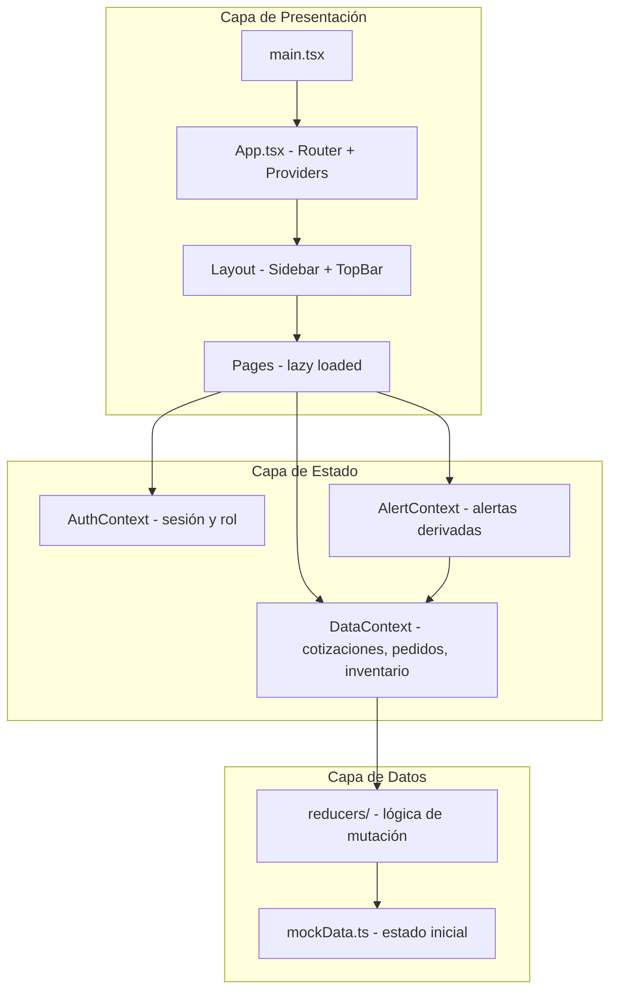
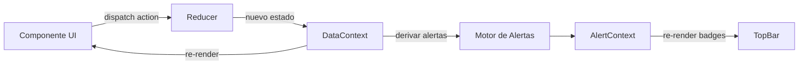
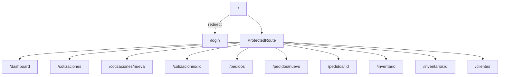
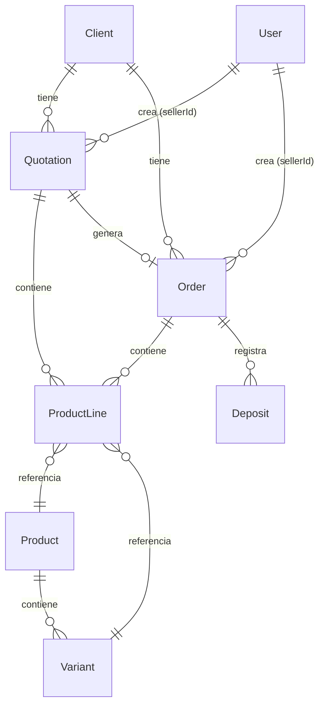

# Documento de Diseño — SYK Dashboard UI

## Resumen (Overview)

SYK Dashboard es una PWA tipo backoffice construida con React 19, TypeScript 6 y Vite 8. La aplicación gestiona cotizaciones, pedidos e inventario con datos mock en memoria. Implementa autenticación simulada con dos roles (admin/vendedor), navegación SPA con code-splitting, un sistema de alertas reactivo y diseño responsivo con estilo de minimalismo exagerado.

### Decisiones de Diseño Clave

| Decisión | Elección | Justificación |
|----------|----------|---------------|
| Enrutamiento | react-router-dom v7 | Estándar de facto para SPAs React, soporte lazy routes |
| Estado global | React Context + useReducer | Sin backend real, la complejidad no justifica Redux/Zustand |
| Estilos | CSS vanilla + custom properties | Requisito del proyecto, rendimiento óptimo |
| Datos mock | Módulo TypeScript exportando estado inicial | Predecible, tipado, fácil de resetear |
| Code splitting | React.lazy + Suspense por ruta | Reduce bundle inicial, mejora FCP |
| Iconos | SVG sprites (Lucide) | Tamaño mínimo, estilo consistente |

---

## Arquitectura

### Diagrama de Alto Nivel



### Flujo de Datos



### Estrategia de Enrutamiento



---

## Componentes e Interfaces

### Jerarquía de Componentes

```
App
├── AuthProvider
│   └── Router
│       ├── LoginPage
│       └── ProtectedRoute
│           └── DataProvider
│               └── AlertProvider
│                   └── AppLayout
│                       ├── Sidebar
│                       │   ├── NavLink (×N: Dashboard, Cotizaciones, Pedidos, Inventario, Clientes)
│                       │   └── UserInfo
│                       ├── TopBar
│                       │   ├── HamburgerButton (mobile)
│                       │   ├── Breadcrumb
│                       │   └── AlertBell
│                       │       └── AlertPanel (dropdown)
│                       └── <Outlet> (page content)
│                           ├── DashboardPage
│                           │   ├── MetricCard (×3)
│                           │   └── AlertList
│                           ├── QuotationListPage
│                           │   ├── SearchBar
│                           │   ├── StatusFilter
│                           │   └── DataTable
│                           ├── QuotationFormPage
│                           │   ├── ClientSelect
│                           │   │   └── InlineClientForm (toggle)
│                           │   ├── DatePicker (estimatedDeliveryDate, opcional)
│                           │   ├── ProductLineList
│                           │   │   └── ProductLineRow (×N)
│                           │   │       ├── ProductSelect
│                           │   │       ├── VariantSelect
│                           │   │       ├── QuantityInput
│                           │   │       └── PriceInput
│                           │   └── FormActions
│                           ├── QuotationDetailPage
│                           │   ├── QuotationHeader (incluye estimatedDeliveryDate si existe)
│                           │   ├── ProductLineTable
│                           │   ├── ApprovalActions (admin only)
│                           │   └── ConvertToOrderAction (admin + vendedor propio)
│                           ├── OrderListPage
│                           │   ├── SearchBar
│                           │   ├── StatusFilter
│                           │   └── DataTable (con indicadores)
│                           ├── OrderFormPage
│                           │   ├── ClientSelect
│                           │   ├── DatePicker (dueDate)
│                           │   ├── ProductLineList
│                           │   └── FormActions
│                           ├── OrderDetailPage
│                           │   ├── OrderHeader
│                           │   ├── ProductLineTable
│                           │   ├── DepositSection
│                           │   │   ├── DepositList (tabla de depósitos)
│                           │   │   ├── DepositSummary (total acumulado, saldo pendiente)
│                           │   │   └── DepositForm (agregar depósito)
│                           │   └── DeliveryAction (admin only)
│                           ├── InventoryListPage
│                           │   ├── SearchBar
│                           │   └── DataTable
│                           ├── InventoryDetailPage
│                           │   ├── ProductHeader
│                           │   ├── VariantTable
│                           │   └── AddVariantForm (admin only)
│                           └── ClientListPage
│                               ├── SearchBar
│                               ├── DataTable (nombre, email, teléfono, acciones)
│                               └── Modal (ClientForm — crear/editar)
```

### Componentes Nuevos (Requerimientos 17-21)

| Componente | Props Principales | Responsabilidad |
|------------|-------------------|-----------------|
| `ClientListPage` | — | Página CRUD de clientes con tabla, búsqueda, modal de formulario |
| `ClientForm` | `client?`, `onSave`, `onCancel`, `errors` | Formulario de crear/editar cliente (nombre, email, teléfono) |
| `InlineClientForm` | `onSave`, `onCancel` | Formulario embebido en QuotationFormPage para crear cliente sin salir del flujo |
| `DepositSection` | `order`, `deposits`, `onAdd`, `onRemove` | Sección de depósitos en OrderDetailPage con lista, totales y formulario |
| `DepositForm` | `pendingBalance`, `onSave`, `onCancel`, `errors` | Formulario para registrar un depósito (monto, método, fecha) |
| `ConfirmDialog` | `open`, `title`, `message`, `onConfirm`, `onCancel` | Diálogo de confirmación reutilizable (usado en eliminación de clientes) |

### Interfaces de Componentes Nuevos

```typescript
// Formulario de cliente
interface ClientFormProps {
  client?: Client;               // undefined = crear, definido = editar
  onSave: (data: Omit<Client, 'id'>) => void;
  onCancel: () => void;
  errors?: ValidationError[];
}

// Formulario inline de cliente (en cotización)
interface InlineClientFormProps {
  onSave: (data: Omit<Client, 'id'>) => void;
  onCancel: () => void;
}

// Sección de depósitos en detalle de pedido
interface DepositSectionProps {
  order: Order;
  onAdd: (deposit: Omit<Deposit, 'id'>) => void;
  onRemove: (depositId: string) => void;
  isDelivered: boolean;
}

// Formulario de depósito
interface DepositFormProps {
  pendingBalance: number;
  onSave: (data: Omit<Deposit, 'id'>) => void;
  onCancel: () => void;
}

// Diálogo de confirmación
interface ConfirmDialogProps {
  open: boolean;
  title: string;
  message: string;
  onConfirm: () => void;
  onCancel: () => void;
  variant?: 'destructive' | 'default';
}
```

### Componentes Reutilizables (UI Kit)

| Componente | Props Principales | Responsabilidad |
|------------|-------------------|-----------------|
| `DataTable` | `columns`, `data`, `onRowClick`, `emptyMessage` | Tabla genérica con soporte para indicadores por fila |
| `SearchBar` | `value`, `onChange`, `placeholder` | Campo de búsqueda con ícono y debounce |
| `StatusFilter` | `options`, `value`, `onChange` | Selector de filtro por estado |
| `MetricCard` | `title`, `value`, `icon`, `variant` | Tarjeta de métrica para dashboard |
| `AlertBadge` | `count` | Badge numérico sobre ícono |
| `Modal` | `open`, `onClose`, `title`, `children` | Diálogo modal genérico |
| `Button` | `variant`, `size`, `disabled`, `onClick` | Botón con variantes (primary, secondary, destructive, ghost) |
| `FormField` | `label`, `error`, `children` | Wrapper de campo con label y mensaje de error |
| `Select` | `options`, `value`, `onChange`, `placeholder` | Select estilizado |
| `StatusBadge` | `status`, `variant` | Etiqueta visual de estado |
| `RoleGate` | `allowedRoles`, `children`, `fallback` | Renderizado condicional por rol |
| `EmptyState` | `icon`, `title`, `description`, `action` | Estado vacío para listas |

### Interfaces de Componentes Clave

```typescript
// Layout
interface AppLayoutProps {
  children: React.ReactNode;
}

// Protección de rutas
interface ProtectedRouteProps {
  allowedRoles?: Role[];
}

// Tabla genérica
interface Column<T> {
  key: keyof T | string;
  header: string;
  render?: (item: T) => React.ReactNode;
  sortable?: boolean;
}

interface DataTableProps<T> {
  columns: Column<T>[];
  data: T[];
  onRowClick?: (item: T) => void;
  rowClassName?: (item: T) => string;
  emptyMessage?: string;
}

// Línea de producto (cotización/pedido)
interface ProductLineProps {
  line: ProductLine;
  products: Product[];
  onChange: (updated: ProductLine) => void;
  onRemove: () => void;
  showStockWarning?: boolean;
}
```

---

## Modelos de Datos

### Tipos Principales

```typescript
// === Roles y Autenticación ===
type Role = 'admin' | 'vendedor';

interface User {
  id: string;
  name: string;
  role: Role;
}

interface AuthState {
  user: User | null;
  isAuthenticated: boolean;
}

// === Clientes ===
interface Client {
  id: string;
  name: string;
  email: string;
  phone: string;
}

// === Inventario ===
interface Variant {
  id: string;
  size: string;       // Talla: "S", "M", "L", "XL", etc.
  color: string;      // Color: "Rojo", "Azul", etc.
  stock: number;
  minStock: number;
}

interface Product {
  id: string;
  name: string;
  category: string;
  variants: Variant[];
}

// === Cotizaciones ===
type QuotationStatus = 'borrador' | 'pendiente' | 'aprobada' | 'rechazada';

interface ProductLine {
  id: string;
  productId: string;
  variantId: string;
  quantity: number;
  unitPrice: number;   // Precio manual
  subtotal: number;    // quantity × unitPrice (derivado)
}

interface Quotation {
  id: string;
  number: string;      // Ej: "COT-001"
  clientId: string;
  sellerId: string;
  lines: ProductLine[];
  total: number;       // Suma de subtotales (derivado)
  status: QuotationStatus;
  notes: string;
  estimatedDeliveryDate?: string;  // ISO date — fecha de envío/entrega estimada (opcional)
  createdAt: string;   // ISO date
  updatedAt: string;   // ISO date
}

// === Pedidos ===
type OrderStatus = 'activo' | 'entregado';

// === Depósitos (Pagos parciales) ===
type PaymentMethod = 'transferencia' | 'efectivo';

interface Deposit {
  id: string;
  amount: number;           // Monto del depósito (positivo)
  method: PaymentMethod;    // Método de pago
  date: string;             // ISO date — fecha del depósito
}

interface Order {
  id: string;
  number: string;       // Ej: "PED-001"
  clientId: string;
  sellerId: string;
  lines: ProductLine[];
  total: number;
  status: OrderStatus;
  notes: string;
  dueDate: string;      // ISO date — fecha de entrega
  quotationId?: string; // Si fue creado desde cotización
  deposits: Deposit[];  // Lista de depósitos/pagos registrados
  createdAt: string;
  updatedAt: string;
}

// === Alertas ===
type AlertSeverity = 'warning' | 'critical';
type AlertType = 'due_soon' | 'overdue' | 'low_stock';

interface Alert {
  id: string;
  type: AlertType;
  severity: AlertSeverity;
  message: string;
  resourceType: 'order' | 'product';
  resourceId: string;
}

// === Estado Global ===
interface AppData {
  clients: Client[];
  products: Product[];
  quotations: Quotation[];
  orders: Order[];
}
```

### Diagrama de Relaciones



### Gestión de Estado

#### Contextos React

```typescript
// AuthContext — sesión del usuario
interface AuthContextValue {
  state: AuthState;
  login: (role: Role) => void;
  logout: () => void;
}

// DataContext — datos de negocio
interface DataContextValue {
  data: AppData;
  dispatch: React.Dispatch<DataAction>;
}

// AlertContext — alertas derivadas (computadas desde DataContext)
interface AlertContextValue {
  alerts: Alert[];
  alertCount: number;
}
```

#### Acciones del Reducer (DataAction)

```typescript
type DataAction =
  // Cotizaciones
  | { type: 'QUOTATION_CREATE'; payload: Omit<Quotation, 'id' | 'number' | 'createdAt' | 'updatedAt'> }
  | { type: 'QUOTATION_UPDATE'; payload: { id: string; changes: Partial<Quotation> } }
  | { type: 'QUOTATION_APPROVE'; payload: { id: string } }
  | { type: 'QUOTATION_REJECT'; payload: { id: string } }
  // Pedidos
  | { type: 'ORDER_CREATE'; payload: Omit<Order, 'id' | 'number' | 'createdAt' | 'updatedAt'> }
  | { type: 'ORDER_CREATE_FROM_QUOTATION'; payload: { quotationId: string; dueDate: string } }
  | { type: 'ORDER_MARK_DELIVERED'; payload: { id: string } }
  // Inventario
  | { type: 'VARIANT_ADD'; payload: { productId: string; variant: Omit<Variant, 'id'> } }
  | { type: 'VARIANT_UPDATE_STOCK'; payload: { productId: string; variantId: string; stock: number } }
  // Stock (interno, al crear pedido)
  | { type: 'STOCK_DEDUCT'; payload: { items: Array<{ variantId: string; quantity: number }> } }
  // Clientes (Req 17, 18)
  | { type: 'CLIENT_CREATE'; payload: Omit<Client, 'id'> }
  | { type: 'CLIENT_UPDATE'; payload: { id: string; changes: Partial<Omit<Client, 'id'>> } }
  | { type: 'CLIENT_DELETE'; payload: { id: string } }
  // Depósitos (Req 21)
  | { type: 'DEPOSIT_ADD'; payload: { orderId: string; deposit: Omit<Deposit, 'id'> } }
  | { type: 'DEPOSIT_REMOVE'; payload: { orderId: string; depositId: string } };
```

### Motor de Alertas (Derivación)

Las alertas se computan reactivamente desde el estado de datos, no se almacenan:

```typescript
function computeAlerts(data: AppData, today: Date): Alert[] {
  const alerts: Alert[] = [];

  // Pedidos por vencer (0 < días restantes ≤ 2)
  for (const order of data.orders) {
    if (order.status !== 'activo') continue;
    const daysUntilDue = diffDays(new Date(order.dueDate), today);
    if (daysUntilDue <= 0) {
      alerts.push({ type: 'overdue', severity: 'critical', ... });
    } else if (daysUntilDue <= 2) {
      alerts.push({ type: 'due_soon', severity: 'warning', ... });
    }
  }

  // Stock bajo
  for (const product of data.products) {
    for (const variant of product.variants) {
      if (variant.stock <= variant.minStock) {
        alerts.push({ type: 'low_stock', severity: 'warning', ... });
      }
    }
  }

  // Ordenar: críticas primero
  return alerts.sort((a, b) => severityOrder(b.severity) - severityOrder(a.severity));
}
```

---

## Propiedades de Corrección (Correctness Properties)

*Una propiedad es una característica o comportamiento que debe cumplirse en todas las ejecuciones válidas de un sistema — esencialmente, una declaración formal sobre lo que el sistema debe hacer. Las propiedades sirven como puente entre especificaciones legibles por humanos y garantías de corrección verificables por máquinas.*

### Propiedad 1: Cálculo de totales en líneas de producto

*Para cualquier* lista de líneas de producto con cantidades y precios unitarios arbitrarios (positivos), el subtotal de cada línea SHALL ser igual a `quantity × unitPrice`, y el total del documento (cotización o pedido) SHALL ser igual a la suma de todos los subtotales.

**Valida: Requerimientos 5.3, 5.5**

### Propiedad 2: Filtrado por estado retorna solo elementos coincidentes

*Para cualquier* colección de elementos con estado (cotizaciones o pedidos) y cualquier filtro de estado válido, el resultado filtrado SHALL contener únicamente elementos cuyo estado coincida exactamente con el filtro seleccionado.

**Valida: Requerimientos 4.2, 7.4**

### Propiedad 3: Búsqueda textual filtra correctamente

*Para cualquier* cadena de búsqueda no vacía y cualquier conjunto de elementos (cotizaciones, productos), los resultados SHALL contener únicamente elementos donde el nombre del cliente (o nombre/categoría del producto) o el número de documento contenga la cadena de búsqueda (case-insensitive).

**Valida: Requerimientos 4.3, 10.4**

### Propiedad 4: Generación de alertas según condiciones de negocio

*Para cualquier* conjunto de datos (pedidos activos y variantes de producto) y una fecha actual dada:
- Todo pedido activo con `0 < daysUntilDue ≤ 2` SHALL generar una alerta tipo "due_soon" con severidad "warning"
- Todo pedido activo con `today > dueDate` SHALL generar una alerta tipo "overdue" con severidad "critical"
- Toda variante con `stock ≤ minStock` SHALL generar una alerta tipo "low_stock" con severidad "warning"
- Ningún otro elemento SHALL generar alertas

**Valida: Requerimientos 12.1, 12.2, 12.3**

### Propiedad 5: Ordenamiento de alertas por severidad

*Para cualquier* conjunto de alertas con severidades mixtas, la lista ordenada SHALL posicionar todas las alertas de severidad "critical" antes que las de severidad "warning".

**Valida: Requerimientos 12.5**

### Propiedad 6: Indicadores de fecha de entrega en pedidos

*Para cualquier* pedido activo y una fecha actual dada:
- Si `0 < daysUntilDue ≤ 2`, la fila SHALL mostrar indicador de advertencia (amarillo)
- Si `today > dueDate`, la fila SHALL mostrar indicador crítico (rojo)
- Si `daysUntilDue > 2`, la fila NO SHALL mostrar indicador

**Valida: Requerimientos 7.2, 7.3**

### Propiedad 7: Creación de pedido desde cotización preserva líneas

*Para cualquier* cotización aprobada con N líneas de producto, al crear un pedido desde ella, el pedido resultante SHALL contener exactamente las mismas N líneas con idénticos productId, variantId, quantity y unitPrice.

**Valida: Requerimientos 6.3**

### Propiedad 8: Creación de pedido descuenta inventario

*Para cualquier* pedido válido con líneas que no excedan el stock disponible, al confirmar el pedido, el stock de cada variante referenciada SHALL decrementar exactamente en la cantidad ordenada.

**Valida: Requerimientos 8.3**

### Propiedad 9: Validación de stock insuficiente

*Para cualquier* línea de producto donde `quantity > variant.stock`, el sistema SHALL señalar stock insuficiente para esa variante específica.

**Valida: Requerimientos 8.5**

### Propiedad 10: Validación de formularios rechaza datos incompletos

*Para cualquier* formulario de cotización sin cliente o sin al menos una línea de producto, o cualquier formulario de pedido sin cliente, sin fecha de entrega o sin al menos una línea, el sistema SHALL rechazar el envío y mostrar mensajes de validación.

**Valida: Requerimientos 5.6, 8.4**

### Propiedad 11: Protección de rutas por autenticación y rol

*Para cualquier* ruta protegida:
- Si el usuario no tiene sesión activa, SHALL redirigir a login
- Si el usuario tiene rol vendedor y la ruta requiere rol admin, SHALL mostrar acceso denegado

**Valida: Requerimientos 1.4, 13.4**

### Propiedad 12: Alcance de datos según rol

*Para cualquier* conjunto de datos con múltiples vendedores:
- Si el usuario es vendedor, las métricas y listados SHALL mostrar solo items donde `sellerId === currentUser.id`
- Si el usuario es admin, las métricas y listados SHALL incluir todos los items sin filtro de vendedor

**Valida: Requerimientos 3.4, 3.5**

### Propiedad 13: Indicador de stock bajo en productos

*Para cualquier* producto, si al menos una de sus variantes tiene `stock ≤ minStock`, la fila del producto en la tabla de inventario SHALL mostrar un indicador visual de stock bajo.

**Valida: Requerimientos 10.2**

### Propiedad 14: Contraste de color WCAG AA

*Para cualquier* par de colores texto/fondo utilizado en la aplicación (definidos en las CSS custom properties), la relación de contraste SHALL ser ≥ 4.5:1.

**Valida: Requerimientos 16.5**

### Propiedad 15: CRUD de clientes preserva integridad del estado

*Para cualquier* estado inicial de clientes:
- Al despachar CLIENT_CREATE con datos válidos (nombre no vacío), la lista de clientes SHALL crecer en exactamente uno y el nuevo cliente SHALL contener los datos proporcionados.
- Al despachar CLIENT_UPDATE con un id existente y cambios parciales, el cliente correspondiente SHALL reflejar los cambios y los demás clientes SHALL permanecer inalterados.
- Al despachar CLIENT_DELETE con un id existente, la lista de clientes SHALL decrecer en exactamente uno y no SHALL contener un cliente con ese id.

**Valida: Requerimientos 17.3, 17.5, 17.7**

### Propiedad 16: Validación de formulario de cliente rechaza nombre vacío

*Para cualquier* dato de cliente donde el nombre es una cadena vacía o compuesta exclusivamente de espacios en blanco, la validación SHALL rechazar el envío e indicar que el nombre es requerido.

**Valida: Requerimientos 17.8, 18.5**

### Propiedad 17: Conversión de cotización a pedido hereda estimatedDeliveryDate como dueDate sugerido

*Para cualquier* cotización aprobada que tenga un `estimatedDeliveryDate` definido, al crear el pedido mediante ORDER_CREATE_FROM_QUOTATION sin especificar un dueDate diferente, el pedido resultante SHALL tener `quotationId` igual al id de la cotización de origen. Además, si se usa el dueDate de la cotización, SHALL coincidir con `estimatedDeliveryDate`.

**Valida: Requerimientos 19.5, 20.3, 20.5**

### Propiedad 18: Agregar y eliminar depósitos mantiene consistencia

*Para cualquier* pedido y cualquier depósito válido (monto > 0, fecha no vacía):
- Al despachar DEPOSIT_ADD, la lista de depósitos del pedido SHALL crecer en exactamente uno y el depósito agregado SHALL contener el monto, método y fecha proporcionados.
- Al despachar DEPOSIT_REMOVE con un depositId existente, la lista de depósitos SHALL decrecer en exactamente uno y no SHALL contener un depósito con ese id.
- Los demás pedidos SHALL permanecer inalterados en ambos casos.

**Valida: Requerimientos 21.3, 21.7**

### Propiedad 19: Cálculo de saldo pendiente y advertencia de exceso

*Para cualquier* pedido con total T y una lista de depósitos con montos [d₁, d₂, ..., dₙ]:
- El saldo pendiente SHALL ser igual a `T - Σdᵢ` (total menos suma de todos los depósitos).
- Si un nuevo depósito tiene monto mayor que el saldo pendiente actual, el sistema SHALL señalar una advertencia de exceso.
- El total acumulado de depósitos SHALL ser igual a `Σdᵢ`.

**Valida: Requerimientos 21.4, 21.6**

---

## Manejo de Errores

### Errores de Validación de Formularios

| Escenario | Comportamiento |
|-----------|---------------|
| Cotización sin cliente | Mostrar error en campo cliente, bloquear envío |
| Cotización sin líneas | Mostrar mensaje "Agrega al menos un producto" |
| Pedido sin fecha de entrega | Mostrar error en campo dueDate |
| Pedido con cantidad > stock | Mostrar advertencia inline en la línea afectada |
| Variante sin talla o color | Mostrar error en campos requeridos |
| Cantidad ≤ 0 | Mostrar error "La cantidad debe ser mayor a 0" |
| Precio ≤ 0 | Mostrar error "El precio debe ser mayor a 0" |
| Cliente sin nombre | Mostrar error "El nombre es requerido" en formulario de cliente |
| Depósito sin monto | Mostrar error "El monto es requerido" |
| Depósito sin fecha | Mostrar error "La fecha es requerida" |
| Depósito con monto > saldo pendiente | Mostrar advertencia "El monto supera el saldo pendiente" (no bloquea envío) |
| Conversión de cotización sin dueDate | Mostrar error "La fecha de entrega es requerida" |

### Errores de Navegación y Acceso

| Escenario | Comportamiento |
|-----------|---------------|
| Ruta protegida sin sesión | Redirect a `/login` |
| Ruta de admin accedida por vendedor | Mostrar página "Acceso Denegado" con botón a Dashboard |
| ID de recurso inexistente en URL | Mostrar página "No Encontrado" con opción de volver |

### Errores de Estado

| Escenario | Comportamiento |
|-----------|---------------|
| Acción sobre recurso en estado inválido (ej: aprobar cotización ya aprobada) | Ignorar acción, botón deshabilitado |
| Pedido entregado — intentar editar | Todos los controles deshabilitados |
| Pedido entregado — intentar eliminar depósito | Botón de eliminar deshabilitado, agregar permitido |
| Eliminar cliente referenciado en cotizaciones/pedidos existentes | Permitir eliminación (datos mock, sin integridad referencial estricta) |
| Descontar stock que ya fue modificado | Usar valor actual del state al momento del dispatch |

### Estrategia General

- Validación client-side antes de dispatch (fail fast)
- Mensajes de error descriptivos junto al campo afectado (inline errors)
- No usar alertas/modales para errores de validación
- Errores de navegación resueltos con componentes de fallback
- Sin errores de red (datos en memoria) — no se necesita retry logic

---

## Estrategia de Testing

### Enfoque Dual: Tests Unitarios + Tests de Propiedad

#### Tests Unitarios (Vitest + React Testing Library)

Cubren escenarios específicos, edge cases y comportamiento de UI:

- **Componentes**: Renderizado correcto, interacciones, estados condicionales
- **Reducers**: Transiciones de estado específicas (aprobar, rechazar, entregar)
- **Hooks**: useAuth, useAlerts — comportamiento con datos concretos
- **Integración**: Flujos completos (crear cotización → aprobar → crear pedido)

Foco: No sobrecargar con tests unitarios — los tests de propiedad cubren variabilidad de inputs.

#### Tests de Propiedad (fast-check)

Validan propiedades universales definidas en la sección de Correctness Properties:

- **Librería**: `fast-check` (JavaScript/TypeScript, compatible con Vitest)
- **Mínimo**: 100 iteraciones por propiedad
- **Tag**: Cada test referencia su propiedad del documento de diseño
- **Formato de tag**: `Feature: syk-dashboard-ui, Property {N}: {texto de la propiedad}`

**Propiedades priorizadas para PBT (todas las 19):**

| # | Propiedad | Tipo de Patrón |
|---|-----------|----------------|
| 1 | Cálculo de totales | Invariante aritmético |
| 2 | Filtrado por estado | Invariante de filtro |
| 3 | Búsqueda textual | Invariante de filtro |
| 4 | Generación de alertas | Lógica de negocio pura |
| 5 | Ordenamiento de alertas | Invariante de orden |
| 6 | Indicadores de fecha | Lógica de fecha |
| 7 | Cotización→Pedido preserva líneas | Round-trip |
| 8 | Descuento de inventario | Invariante de estado |
| 9 | Validación de stock | Condición de error |
| 10 | Validación de formularios | Condiciones de error |
| 11 | Protección de rutas | Control de acceso |
| 12 | Alcance de datos por rol | Filtrado metamórfico |
| 13 | Indicador stock bajo | Condición derivada |
| 14 | Contraste WCAG | Cálculo numérico |
| 15 | CRUD de clientes | Invariante de estado |
| 16 | Validación de cliente (nombre vacío) | Condición de error |
| 17 | Conversión cotización→pedido hereda fecha | Round-trip / preservación |
| 18 | Agregar/eliminar depósitos | Invariante de estado |
| 19 | Saldo pendiente y advertencia de exceso | Invariante aritmético |

#### Generadores (fast-check)

```typescript
import * as fc from 'fast-check';

// Línea de producto
const arbProductLine = fc.record({
  id: fc.uuidV(4),
  productId: fc.uuidV(4),
  variantId: fc.uuidV(4),
  quantity: fc.integer({ min: 1, max: 1000 }),
  unitPrice: fc.integer({ min: 1, max: 100000 }),
});

// Estados
const arbQuotationStatus = fc.constantFrom(
  'borrador', 'pendiente', 'aprobada', 'rechazada'
);
const arbOrderStatus = fc.constantFrom('activo', 'entregado');

// Variante de inventario
const arbVariant = fc.record({
  id: fc.uuidV(4),
  size: fc.constantFrom('XS', 'S', 'M', 'L', 'XL', 'XXL'),
  color: fc.constantFrom('Rojo', 'Azul', 'Verde', 'Negro', 'Blanco'),
  stock: fc.integer({ min: 0, max: 500 }),
  minStock: fc.integer({ min: 1, max: 50 }),
});

// Fecha de entrega (rango relativo a hoy)
const arbDueDate = fc.date({
  min: new Date(Date.now() - 10 * 86400000),
  max: new Date(Date.now() + 30 * 86400000),
});

// Cadena de búsqueda
const arbSearchQuery = fc.string({ minLength: 1, maxLength: 20 })
  .filter(s => s.trim().length > 0);

// Cliente
const arbClient = fc.record({
  id: fc.uuidV(4),
  name: fc.string({ minLength: 1, maxLength: 50 }).filter(s => s.trim().length > 0),
  email: fc.emailAddress(),
  phone: fc.stringMatching(/^\+?[0-9]{7,15}$/),
});

// Datos parciales de cliente (para crear/editar)
const arbClientData = fc.record({
  name: fc.string({ minLength: 1, maxLength: 50 }).filter(s => s.trim().length > 0),
  email: fc.emailAddress(),
  phone: fc.stringMatching(/^\+?[0-9]{7,15}$/),
});

// Método de pago
const arbPaymentMethod = fc.constantFrom('transferencia', 'efectivo');

// Depósito
const arbDeposit = fc.record({
  id: fc.uuidV(4),
  amount: fc.integer({ min: 1, max: 10000000 }),
  method: arbPaymentMethod,
  date: fc.date({
    min: new Date(Date.now() - 60 * 86400000),
    max: new Date(Date.now() + 5 * 86400000),
  }).map(d => d.toISOString().slice(0, 10)),
});

// Datos parciales de depósito (para agregar)
const arbDepositData = fc.record({
  amount: fc.integer({ min: 1, max: 10000000 }),
  method: arbPaymentMethod,
  date: fc.date({
    min: new Date(Date.now() - 60 * 86400000),
    max: new Date(Date.now() + 5 * 86400000),
  }).map(d => d.toISOString().slice(0, 10)),
});
```

### Estructura de Archivos de Test

```
src/
├── lib/
│   ├── computeAlerts.ts
│   ├── computeAlerts.test.ts           # Unit tests
│   ├── computeAlerts.property.test.ts  # PBT (Propiedades 4, 5)
│   ├── calculateTotals.ts
│   ├── calculateTotals.property.test.ts # PBT (Propiedad 1)
│   ├── filterByStatus.ts
│   ├── filterByStatus.property.test.ts  # PBT (Propiedad 2)
│   ├── searchFilter.ts
│   ├── searchFilter.property.test.ts    # PBT (Propiedad 3 — incluye búsqueda de clientes)
│   ├── stockValidation.ts
│   ├── stockValidation.property.test.ts # PBT (Propiedades 8, 9)
│   ├── formValidation.ts
│   ├── formValidation.property.test.ts  # PBT (Propiedad 10)
│   ├── clientValidation.ts
│   ├── clientValidation.property.test.ts # PBT (Propiedad 16)
│   ├── depositValidation.ts
│   ├── depositValidation.property.test.ts # PBT (Propiedad 19)
│   ├── dataReducer.ts
│   ├── dataReducer.property.test.ts     # PBT (Propiedad 15 — CRUD clientes)
│   ├── dataReducer.deposits.property.test.ts # PBT (Propiedad 18 — depósitos)
│   ├── contrastCheck.ts
│   └── contrastCheck.property.test.ts   # PBT (Propiedad 14)
├── hooks/
│   ├── useAuth.ts
│   ├── useAuth.test.ts
│   ├── useDataScope.ts
│   └── useDataScope.property.test.ts    # PBT (Propiedad 12)
├── components/
│   ├── ProtectedRoute.tsx
│   ├── ProtectedRoute.property.test.ts  # PBT (Propiedad 11)
│   ├── DueDateIndicator.tsx
│   ├── DueDateIndicator.property.test.ts # PBT (Propiedad 6)
│   ├── LowStockIndicator.tsx
│   └── LowStockIndicator.property.test.ts # PBT (Propiedad 13)
└── pages/
    ├── QuotationFormPage.tsx
    ├── QuotationFormPage.test.tsx        # Unit tests (inline client form UI)
    ├── OrderFromQuotation.property.test.ts # PBT (Propiedades 7, 17)
    ├── ClientListPage.tsx
    ├── ClientListPage.test.tsx           # Unit tests (tabla, búsqueda, modal)
    ├── OrderDetailPage.tsx
    └── OrderDetailPage.test.tsx          # Unit tests (sección depósitos UI)
```

### Configuración

- **Test runner**: Vitest (incluido con Vite, configuración en `vite.config.ts`)
- **Testing library**: `@testing-library/react` + `@testing-library/user-event`
- **PBT**: `fast-check` (^4.x)
- **Cobertura mínima**: 80% en módulos de lógica (`src/lib/`, `src/hooks/`)
- **CI**: `vitest --run` (ejecución única, sin watch mode)
- **Cada test de propiedad**: mínimo 100 iteraciones (`fc.assert(prop, { numRuns: 100 })`)
